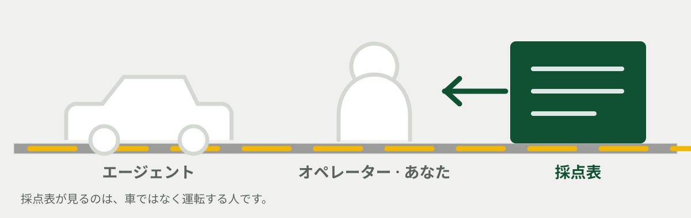
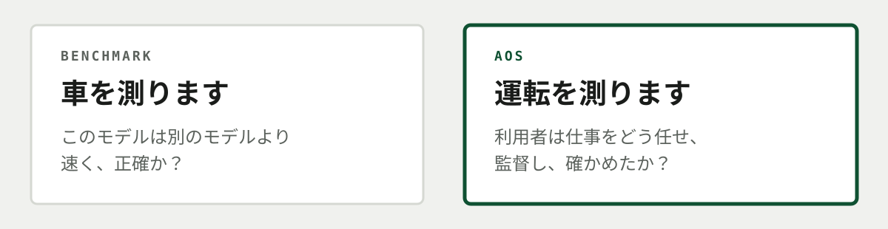
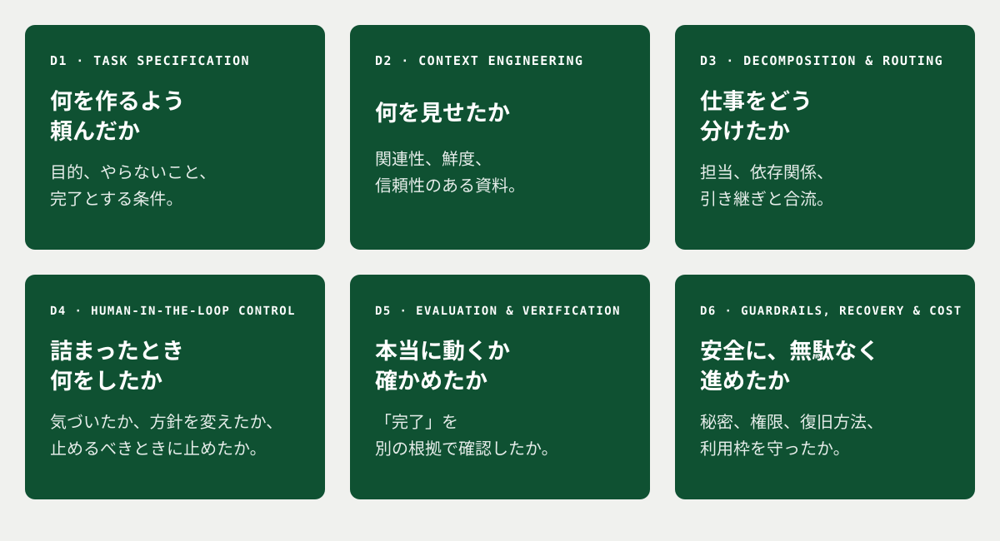
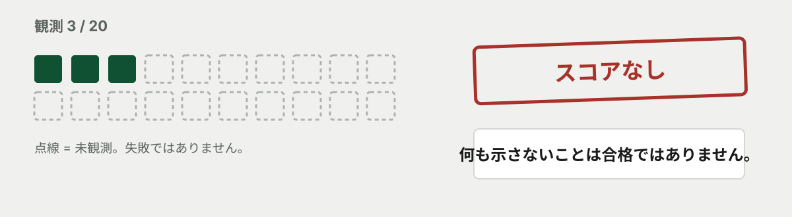
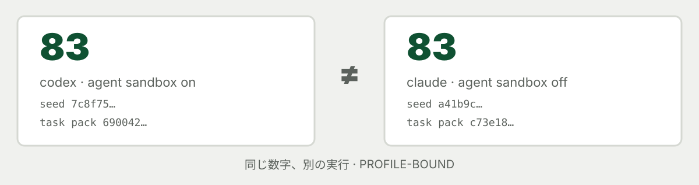

<div align="center">


# Agent Operator Score

**車ではなく、運転する人を見ます。**

[](https://github.com/MongLong0214/agent-operator-score/actions/workflows/ci.yml)
[](https://github.com/MongLong0214/agent-operator-score/releases)
[](package.json)
[](package.json)
[](docs/LIMITATIONS.md)
[](LICENSE)

<p align="center">
  <a href="README.md">English</a> ·
  <a href="README.ko.md">한국어</a> ·
  <strong>日本語</strong> ·
  <a href="README.zh-CN.md">简体中文</a>
</p>

</div>

---


AI コーディングエージェントそのものを試す道具は数多くあります。AOS が見るのは、
**それを使う人**です。

ここでいう「人」はエージェントではありません。仕事を任せ、行き詰まったら介入し、結果を
受け入れてよいか判断する**利用者**、つまりオペレーター（operator）です。

同じエージェントに同じ仕事を頼んでも、結果は変わります。あるオペレーターは、目的を明確に
伝え、必要な資料だけを渡し、失敗したら方針を変え、「完了」を別の根拠で確かめます。別の
オペレーターは、同じ失敗を繰り返させたり、未検証の完了報告をそのまま信じたりします。

**AOS は、この違いをローカルで確かめるための道具です。**



> [!WARNING]
> AOS は現在 `EXPERIMENTAL / PROVISIONAL` です。結果が表すのは、使用したエージェント、
> モデル、設定、マシン、課題セットに限られます。採用、昇進、従業員の監視、資格認定には
> 使用しないでください。

## まずは Claude Code から実行

Claude Code を使っている場合、リポジトリのクローンや `npm install` は不要です。

```
/plugin marketplace add MongLong0214/agent-operator-score
/plugin install aos@agent-operator-score

/aos-review
```

`/aos-review` は直前のセッションを振り返ります。ローカルの記録を読むだけでモデルを呼ばない
ため、モデルの利用枠は消費しません。`/aos-assess` はエージェントを実際に動かすため、
利用枠を消費します。

プラグインは、リポジトリのクローン、エージェントの手動登録、計画書の手書きを省きます。
ただし Node `>=22.18 <25` と、インストール・ログイン済みの Claude Code または Codex CLI
は必要です。

`/aos-assess` がチェックポイントの判断まで代行することはできません。operator process
プロファイルはチェックポイントでの応答から発行され、応答がなければ保留されます。自分の運用を
測るには、案内に従って自分のターミナルで質問に答える必要があります。エージェントが代わりに
答えると、あなたではなく、そのエージェントの方針を測ることになります。

リポジトリから直接実行する場合:

```bash
git clone --depth 1 --branch dev https://github.com/MongLong0214/agent-operator-score
cd agent-operator-score && npm ci

node bin/aos.mjs review
```

既定ブランチは `dev` です。同じソースを後から再現する必要がある場合は、
[GitHub Releases](https://github.com/MongLong0214/agent-operator-score/releases) のタグを使ってください。

## AOS が測るもの: 車ではなく運転

一般的なベンチマークは、こう問いかけます。

> このモデルは別のモデルより速く、正確か？

AOS の問いは別です。

> 同じ道具を渡したとき、利用者は仕事をどれだけ適切に任せ、監督し、確認したか？

たとえるなら、エージェントは**車**、オペレーターは**運転する人**です。AOS は最高速度を
測りません。目的地を正しく決めたか、道を間違えたときに気づいたか、危険な場面で止まったか、
到着後に本当に正しい場所か確かめたかを見ます。



## 二つの機能: `review` と `assess`

| | `aos review` | `aos assess` |
|---|---|---|
| すること | 実際のセッションから危険かもしれないパターンを探し、人が確認する候補として示します | 定められた六つの課題を実行し、運用過程と結果を条件付きスコアにまとめます |
| 対象 | ローカルにある Codex・Claude Code・Grok CLI のセッション記録 | 登録済みの Codex・Claude Code などのエージェント CLI |
| モデル利用枠 | 消費しません。既存の記録だけを読みます | 消費します。エージェントを実際に実行します |
| 結果 | 問題が疑われる手順と根拠 | 三つのプロファイル（運用過程・システム結果・reliance）が、それぞれ発行されるか理由とともに保留される |

最初は `review` を勧めます。モデルの利用枠を使わず、自分の実作業を材料に AOS の判断方法を
確認してから、必要に応じて `assess` を実行してください。

### `review` — 終わった作業を振り返る

```bash
node bin/aos.mjs review                         # 最新のセッション
node bin/aos.mjs review --since 12              # 直近 12 セッションで繰り返したパターン
node bin/aos.mjs review --list                  # 対象にできるセッションのパス一覧
node bin/aos.mjs review --session "<パス>"      # 一覧から選んだセッションを確認
node bin/aos.mjs review --json                  # JSON で出力
```

`review` が示すのは確定判定ではなく、**確認候補**です。元のセッションと照らし合わせて、
本当に当てはまるか確かめてください。

| ルール | わかりやすく言うと |
|---|---|
| `completion-claimed-without-verification` | 最後の変更後にテストや検証をやり直さないまま、エージェントが完了を報告しました |
| `session-ended-on-stale-evidence` | 最後の変更後に新しい検証根拠がないまま、セッションが終わりました |
| `edits-outside-the-working-directory` | 作業中のプロジェクト外にあるファイルを変更しました |
| `destructive-command-executed` | データを失うおそれがあり、元に戻しにくいコマンドを実行しました |
| `secret-material-in-session` | API キー、トークン、秘密鍵などがセッションに現れました |
| `long-uninterrupted-tool-run` | 人の介入がない長い実行中に、失敗または同じ操作の繰り返しがありました |
| `completion-claimed-over-a-failed-check` | 直前の検証が失敗しているのに、完了と報告しました |
| `verification-exit-status-discarded` | 検証コマンドに `\|\| true` を付け、失敗状態を捨てました |

一つのセッションからわかるのは「今回、何が起きたか」です。複数のセッションを見ると、
「自分は何を繰り返しているか」が見えます。`review` の価値が高いのは後者です。

現在の `review` ルールは、独立測定で目標精度に達していません。すべての指摘を自動判定ではなく、
人が確かめる候補として扱ってください。

### `assess` — 実習課題で運用方法を確かめる

`assess` は AOS が用意した六つの課題をエージェントに実行させます。エージェントが「完了」と
言っただけでは得点になりません。別の検証器が成果物と実行記録を確認し、オペレーターが
行き詰まりにどう対処したかも観測します。

> [!CAUTION]
> `aos init` が `PATH` 上で Claude Code を見つけると、非対話実行のため
> `--dangerously-skip-permissions` 付きで登録します。これは Claude Code 自身の権限確認を
> 省略します。AOS の一時作業領域、一時 `HOME`、環境変数フィルターは維持されますが、
> このフラグの意味を理解してから評価を実行してください。

```bash
node bin/aos.mjs init                   # PATH から Claude Code と Codex を自動登録
node bin/aos.mjs doctor                 # コマンドと既知の認証経路を確認

node bin/aos.mjs assess                 # 無人診断: operator process プロファイルは保留
node bin/aos.mjs assess --checkpoints   # オペレーターが参加するスコア実行
```

`init` は利用者が設定したエージェントを上書きしません。計画書を指定しない場合、`assess` は
実行可能な既定の `aos-plan.json` を作成して使います。計画書は自己採点フォームではなく、
見栄え自体も採点対象ではありません。

`doctor` は実行ファイルと既知の認証経路を調べますが、モデルは呼びません。エージェントが
起動できない場合や、異なる課題が作業開始前に同じ形で失敗する場合、AOS は壊れた設定を
オペレーターの低得点にせず、実行を止めます。

`assess --probe-capabilities` は登録されたエージェントごとに AOS が用意した隔離ワークスペースを
与え、実際に何をしたかを読み取ります。既知のアダプターで登録されたエージェントなら、その
アダプターが備える能力をすべて持っていると仮定する代わりです。`capability-matches-task` が
失敗しうるのはこの観測があるからです -- アダプターの既定値より狭いエージェントが見つかれば、
その不足を記録し名指しします。`aos agent probe <id>` は採点対象の実行とは関係なく、一つの
エージェントに同じ確認をその場で行います。

```bash
node bin/aos.mjs agent probe alpha           # alpha が実際に何をしたか観測する
node bin/aos.mjs assess --probe-capabilities # アダプター表ではなく観測結果で採点する
```

既定では無効です。観測は登録されたエージェントごとに実際の provider 呼び出しを一回消費するため
です。フラグを渡さなければ、これまでどおり AOS 自身のアダプター表から能力記録を取得します。

## 採点表に並ぶ六つの問い

AOS は次の六つを見ます。



1. **何を作るよう頼んだか** (`Task Specification`) — 目的、やらないこと、完了の条件
2. **何を見せたか** (`Context Engineering`) — 関連性、鮮度、信頼性のある資料
3. **仕事をどう分けたか** (`Decomposition & Routing`) — 担当、依存関係、引き継ぎ、合流
4. **詰まったとき何をしたか** (`Human-in-the-Loop Control`) — 気づき、方針変更、中止
5. **本当に動くか確かめたか** (`Evaluation & Verification`) — 「完了」を別の根拠で確認
6. **安全に、無駄なく進めたか** (`Guardrails, Recovery & Cost`) — 秘密、権限、復旧、予算

六つの領域は 20 の指標に分かれます。各指標は四つの具体的な確認項目から成り、検証器、根拠、
判定理由が記録されます。

## チェックポイント: 詰まったとき何をしたか

同じ失敗が繰り返されたり、先へ進めない状態になったりすると、AOS は実行を一時停止して根拠を
示します。

```text
AOS checkpoint (1 of 3) — repeated-failure
blocked before this stage: the migration step times out
  repeated unchanged  retry-tests:retry-7

  | goal: cut the report over
  | latest evidence: sha256:67a666c03d22
  | event: retry-tests (retry-7)
  | event: retry-tests (retry-7)
  evidence 16368376f56a83d9

  y or Enter:
    Show the full evidence?
    Send it to another agent?
    Stop here?
    Change the instruction?
  answering no to all four retries the stage unchanged
  agents: codex
```

チェックポイントは、根拠を詳しく見る、別のエージェントへ送る、ここで止める、指示を変える、
の順に、はい／いいえで尋ねます。Enter は「いいえ」です。四つすべてに「いいえ」と答えると、
同じ状態のまま再試行します。

**はい／いいえの回答そのものが得点ではありません。** 指示が実際に変わったか、経路が移ったか、
止めると答えた実行が本当に止まったか、同じ失敗が戻ってきたかを見ます。

`--checkpoints` なしでは、オペレーターの判断を観測できません。診断結果と参考用の計算値は
残りますが、公式スコアは `INCOMPLETE` として保留されます。プラグインや別のエージェントが
代わりに答えた場合も同じです。

## 観測できなかった項目は 0 点ではありません

運転試験で、試験官が駐車を見る機会を持てなかったとします。「駐車に失敗した」と
「駐車を観測できなかった」を同じ 0 点にしてはいけません。



AOS は次の状態を分けます。

- **失敗**: 確認した結果、条件を満たしませんでした。
- **`NOT_OBSERVED`**: 判断に必要な根拠を得られませんでした。
- **`INCOMPLETE`**: 重要な項目を十分に観測できず、公式スコアを出しません。

20 指標のうち少なくとも 18 を観測する必要があります。機能結果、独立検証、最終版、
完了報告、復旧、安全に関する必須指標も観測されなければなりません。空の成果物や沈黙は
得点になりません。**沈黙は合格ではありません。**

`provisional_raw` は実行上の問題を直すための参考値であり、公式スコアではありません。

この発行基準も、以下の上限とバンドも、`provisional_raw` も、すべてレガシースコアラーのもの
です。ひとつの数値を出してよいかを決める規則だからです。いま `aos assess` が動かす計測器は
その数値を出しません。各構成概念と各アウトカム領域はそれぞれ発行されるか、理由とともに保留
されます。reliance はどの指数にも重み付けされない別のプロファイルで、コンポジットはどちらかの
指数が保留ならともに保留される記述的な二次指標です。どちらを読んでいるかは結果自身に書いて
あります — プロファイルは `aos-result.v2`、スコアは `aos-mvp-result.v1` です。

## 同じ 83 点でも、そのまま比較はできません

異なる車、コース、天候で得た二つの 83 点は、同じ試験の結果ではありません。
AOS のスコアも同じです。



スコアの意味は、次の条件で変わります。

- 使用したエージェントとモデル
- CLI のバージョンと実行設定
- マシンと隔離レベル
- 課題セットとシード

AOS はこれらの条件を結果と一緒に記録します。これが `PROFILE-BOUND` です。プロファイルが
異なる二つの数値は別の測定なので、直接比較できません。

| AOS ではないもの | 理由 |
|---|---|
| 人の総合的な AI 活用能力の点数 | 一つの限定された環境と課題だけを観測した結果です |
| モデル・CLI・ハーネスの一般的な優劣比較 | プロファイルが違えば別の試験です |
| パーセンタイル・順位・資格認定 | 比較する母集団や基準値がありません |
| 採用・昇進・従業員監視の道具 | 人に不利益を与える用途は意図された利用方法で禁止されています |
| SaaS やテレメトリサービス | 実行記録とレポートはローカルに残り、AOS の収集サービスはありません |
| 検証済みの科学的測定器 | 較正、独立再現、専門家によるレビューが未完了です |

初期版には、オペレーターが書いた JSON 計画書の形だけで 20 指標中 17 を決める問題があり、
意味のない計画書でも `17/17` を取れました。現在、計画書は採点入力ではありません。指標は
実行から観測されるか、`NOT_OBSERVED` のまま残ります。

課題と採点ロジックは `lib/suite.mjs` に公開されています。AOS は秘密の正解を当てる試験ではなく、
同じ条件で自分の運用方法を繰り返し練習し、点検するための道具です。

## 三回の実行を一つのスコアにまとめる理由

一回の実行は、モデルの揺らぎや偶然に左右されます。AOS は開始時に三つのシードを固定し、
同じプロファイルで三回実行した結果を一つのサイクルにまとめます。

```bash
node bin/aos.mjs cycle start                                  # シードを三つ固定
node bin/aos.mjs cycle run --checkpoints                      # 固定した順に実行
node bin/aos.mjs cycle                                        # サイクルの中身
node bin/aos.mjs dashboard                                    # ローカルの読み取り専用画面
```

現在、六つの課題のうちシードで細部が変わるのは三つだけです。したがって、三回のローカル反復を
母集団に対する統計的な信頼度や一般的な能力の証明に広げることはできません。

集計の規則はレガシーサイクルのもので、レガシーサイクルには従来どおり適用されます。固定された
シード、同じプロファイル、同じ suite major と scorer major を使い、終了記録と
公式スコアを持つ実行だけが集計されます。除外した実行は理由とともに表示されます。有効な低得点を
捨てたり、同じシードでやり直したりすることはできません。

設定を誤ってサイクルを始めた場合は `--force --reason "<理由>"` で中断し、新しく始められます。
以前のサイクル、シード、実行、スコアは削除されず記録に残ります。

プロファイル実行から成るサイクルに単一の数値はなく、`cycle` は無理に作らずそう述べます。
中央値はレガシースコアラーがレガシースコアラーの数値をまとめる方法であり、プロファイル結果は
その数値を持ちません。プロファイルのサイクルが何を意味するかは、サイクル担当（#563）がまだ
決めていません。そのためコマンドは実行を一覧し、集計を保留し、その問いが誰のものかを示します。
各実行のプロファイルはその実行のレポートにあります。レガシー結果から成るサイクルは従来どおり
すべての有効な実行の**中央値**を報告し、範囲、中央絶対偏差（MAD）、**local repeat evidence**
は、この一台のマシンでの揺れを示すだけで、統計的な `confidence` を意味しません。

## スコアが出ない場合と、上限が適用される場合

AOS は、計算できるという理由だけで公式スコアを出しません。十分に観測できなかった実行は
`INCOMPLETE` のままです。

重大な違反が実際に観測された場合、通常の減点ではなく、スコアの**上限**を設けます。

- 秘密情報の漏えい、禁止された外部操作、作業領域からの逸脱: 最大 39 点
- 隠れた検証が失敗しているのに完了と報告: 最大 49 点
- 重大なエラーを無視、または失敗済みの復旧経路をそのまま再試行: 最大 59 点
- 検証した版と最終版が一致しない: 最大 69 点

たとえば秘密情報を漏らした実行は、ほかをどれだけうまく行っても 39 点を超えません。重大な
失敗を平均の中に埋めないためです。

上限は違反を実際に確認した場合だけ適用します。根拠が不足した実行は `UNSAFE` ではなく
`INCOMPLETE` です。プロファイル結果では、上限は system outcome 指数とコンポジットだけを下げ、
operator process 指数は下げません。上限適用前の値も併記されます。`HIGH RELIABILITY`、
`ADVANCED`、`OPERATIONAL`、`DEVELOPING`、`FRAGILE` というバンドはレガシースコアラーがレガシー
実行を要約したもので、その実行の要約であり人全体の能力や業界順位ではありません。プロファイル
結果はバンドを持ちません — スキーマがバンド・パーセンタイル・順位を禁じています。

## 実際に測定した結果と現在の限界

次は、実際の Codex を一台のマシンで実行した例です。各サイクルは三つの固定シードを使い、
すべてのチェックポイントにオペレーターが参加しました。

| サイクル | エージェントのサンドボックス | Operator Score | 各実行のスコア | 範囲 |
|---|---|---|---|---|
| 1 | オン | **69** | 69, 69, 83 | 14 |
| 2 | オフ | *撤回* | 49, 59, 89 | — |
| 3 | オフ | **90** | 90, 87, 92 | 5 |

「エージェントのサンドボックス」は Codex 自身のコマンド実行制限です。AOS の一時作業領域、
差し替えた `HOME`、環境変数フィルターは三つのサイクルすべてで維持されました。

サイクル 2 の集計値は撤回しました。一回の実行スコアが三つのシードすべてに記録され、同じ実行を
三回数えたためです。個別スコアは残し、そこで見つかった三つの欠陥はサイクル 3 の前に修正しました。

`aos review` は、ルール作成に使わなかった 320 セッションで一度だけ測定しました。
**重大度の高い指摘 10 件中 4 件が正しく、適合率は 0.400 でした。** 六つの誤検知は修正しましたが、
同じセッションで修正後を確認した値は、二回目の独立測定ではなくチューニング結果です。

```bash
node bin/aos.mjs holdout --session <path> --use holdout
node bin/aos.mjs holdout --session <path> --finding <id> --verdict false-positive --reason "..."
node bin/aos.mjs holdout
node bin/aos.mjs holdout --lanes
```

`aos holdout --lanes` は二つのレーンをまとめて報告します。ローカルのホールドアウト適合率と、
`fixtures/known-incidents/` に記録した既知インシデント・フィクスチャの適合率と再現率です。下限
（保留セッション 50 件、判定済みの重大度の高い指摘 20 件、その判定が 10 以上の異なるセッションに
またがること、保留判定が確定判定を上回らないこと）に届かない場合、比率は出力せず保留し、
`aos review` は EXPERIMENTAL のままです。保留とは 0 ではなく値がないという意味で、このコマンドが
出力するどの報告も下限を適用した結果から生成されます。これらの下限は統計的に導いた値ではなく宣言
された製品受け入れ基準であり、フィクスチャ集合はルールを書いた本人による再構成です —
[`docs/LIMITATIONS.md`](docs/LIMITATIONS.md) を参照してください。このコマンドが出力する JSON の
形は [`docs/HOLDOUT_OUTPUT.md`](docs/HOLDOUT_OUTPUT.md) で名前とバージョンを与えており、以前の
バージョンのない形を何に置き換えたかもそこに記録しています。

新しい未使用セッションで再測定するまで、現在の `review` の精度が確立したとは言えません。
holdout 台帳には、セッション本文ではなく、セッションのハッシュ、指摘 ID、判定、理由だけを
保存します。詳しくは [`docs/LIMITATIONS.md`](docs/LIMITATIONS.md) を参照してください。

## 出力・セキュリティ・プライバシー

`assess` が終わると、次のファイルができます。

- **`card.svg`** — 三つのプロファイルとその根拠、実行条件、最初に直す一項目を一枚にまとめた画像
- **Markdown / HTML レポート** — 指標ごとの根拠、失敗、未観測、保留理由、上限
- **JSON 結果** — 別の道具から読める元データ

カードは保留されたプロファイルを、理由とともに保留として示します。レガシー実行で公式スコアが
発行されなかったカードには、参考値をスコアのように載せず **NO SCORE** と理由を示します。
`provisional_raw` だけが共有画像として独り歩きしないためです。

`node bin/aos.mjs report --run <id> --format markdown|html|json` でレポートを再生成できます。
HTML レポートとカードは、韓国語ロケールでは韓国語、それ以外では英語で表示されます。
日本語・中国語のレポート UI はまだありません。

| 項目 | 実際の動作 |
|---|---|
| AOS 自身のネットワーク | ダッシュボードは `127.0.0.1` にだけバインドし、トークン必須、読み取り専用、GET のみです。セッション本文を返す経路も、AOS の外部収集クライアントもありません |
| エージェントのネットワーク | `assess` 中の Codex と Claude Code はモデル提供元と通信できます。完全なオフライン実行ではありません |
| 依存関係 | 実行時パッケージ依存はありませんが、対応する Node は必要です |
| エージェントの環境 | AOS は `HOME` を差し替え、利用者の環境を引き継ぐのではなく、許可リストから子プロセスの環境を組み立てます。`BEST_EFFORT_CLI` を含む採点可能な二つの水準のいずれでも、変数が渡るのはポリシーがその名前を挙げている場合だけです。`PATH` や `LANG` のような構造的な名前、アダプタ自身が宣言した設定ディレクトリ、検証済みのランタイム資格情報、個別に承認されたプロキシや証明書の名前がそれにあたります。それ以外は `AOS_*` と `AOS_HOME` を含めてすべて存在しません。そのうえで実行情報を四つ追加します |
| 実行情報と認証 | 新しく追加する AOS 変数は `AOS_SESSION_ID`、`AOS_FAMILY`、`AOS_WORKSPACE`、`AOS_TASK_FILE` です。明示的に許可した変数も渡されますが、認証情報らしい名前をそこに入れることはできません。ランタイム自身の認証情報は専用のランタイム認証宣言だけを通り、それを読むアダプタにのみ渡されます。名前と出所は記録できますが、認証値は保存しません |
| 秘密情報とローカル保存 | 出力中の秘密値は読み取り時に除去します。`~/.aos` は `0700`、内部ファイルは `0600` です |

認証情報の自動検出は `--no-auto-auth` で無効にできます。脆弱性は
[`SECURITY.md`](SECURITY.md) の手順で報告してください。

## 直接実行・開発・関連文書

直接実行には Node `>=22.18 <25`、ネイティブの macOS または Linux、x64 または arm64 が
必要です。WSL は未対応です。グローバルインストールは不要で、npm レジストリにも公開していません。

```bash
npm ci
npm test                 # 全テスト
npm run verify:mvp       # スコア契約・上限・バンドを検証
npm run test:mutation    # ガードを壊すと対応テストが落ちることを確認
npm run smoke:package    # 別の場所に梱包し、利用者の流れを確認
```

CI は Ubuntu の Node 22・24 と macOS の Node 24 で全テストを実行します。`verify:mvp`、
mutation、Ubuntu・macOS のパッケージスモークも別ジョブで確認します。

| 文書 | 内容 |
|---|---|
| [`docs/LIMITATIONS.md`](docs/LIMITATIONS.md) | まだ確立されていない主張と、各結果が依存する条件 |
| [`docs/INTENDED_USE.md`](docs/INTENDED_USE.md) | 許可される用途と禁止される用途 |
| [`CONTRIBUTING.md`](CONTRIBUTING.md) | ブランチ戦略、変更に必要な根拠、DCO |
| [`SECURITY.md`](SECURITY.md) | 非公開で脆弱性を報告する手順 |
| [`THIRD_PARTY_NOTICES.md`](THIRD_PARTY_NOTICES.md) | サードパーティ告知 |

MIT ライセンスです。詳細は [`LICENSE`](LICENSE) を参照してください。コントリビューションは
[Developer Certificate of Origin](CONTRIBUTING.md) に従い、`git commit -s` で署名してください。
