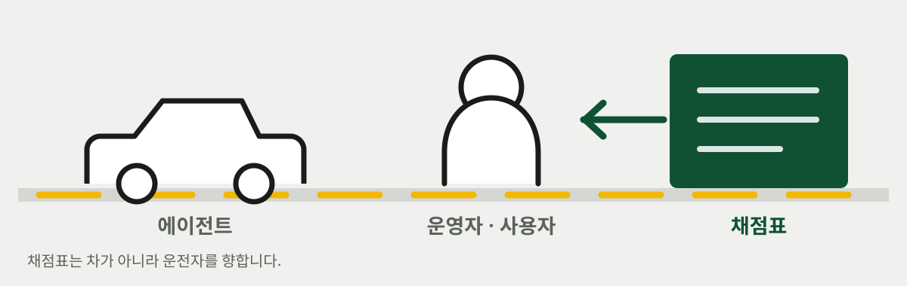
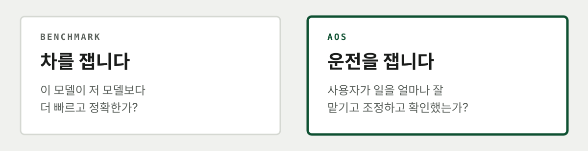
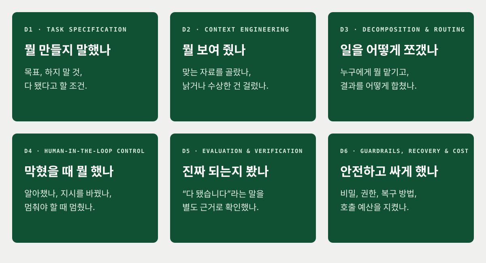
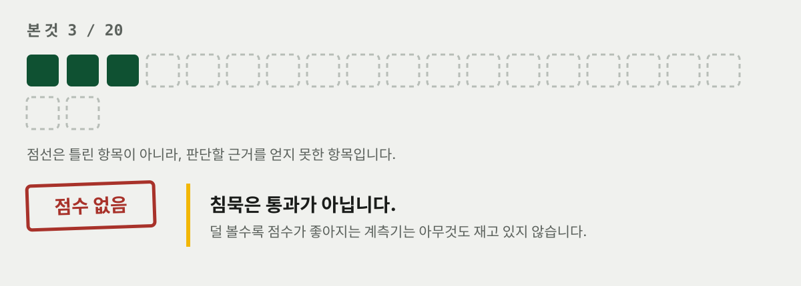
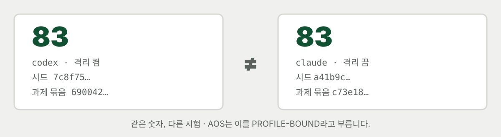

<div align="center">


# Agent Operator Score

**차가 아니라, 운전자를 봅니다.**

[](https://github.com/MongLong0214/agent-operator-score/actions/workflows/ci.yml)
[](https://github.com/MongLong0214/agent-operator-score/releases)
[](package.json)
[](package.json)
[](docs/LIMITATIONS.md)
[](LICENSE)

<p align="center">
  <a href="README.md">English</a> ·
  <strong>한국어</strong> ·
  <a href="README.ja.md">日本語</a> ·
  <a href="README.zh-CN.md">简体中文</a>
</p>

</div>

---


AI 코딩 에이전트 자체를 시험하는 도구는 많습니다. AOS는 **그걸 사용하는 사람**을 봅니다.

여기서 사람은 에이전트가 아닙니다. 에이전트에게 일을 맡기고, 막히면 개입하고, 결과를 받아들일지
결정하는 **사용자**, 즉 운영자(operator)입니다.

같은 에이전트에게 같은 일을 시켜도 결과는 달라집니다. 어떤 운영자는 무엇을 만들지 정확히 말하고,
필요한 자료만 보여 주며, 실패하면 방향을 바꾸고, “다 됐습니다”라는 말을 별도 근거로 확인합니다.
다른 운영자는 같은 실패를 계속 반복하게 두거나, 확인하지 않은 결과를 그대로 완료로 받아들입니다.

**AOS는 이 차이를 살펴보는 로컬 도구입니다.**



> [!WARNING]
> AOS는 현재 `EXPERIMENTAL / PROVISIONAL` 상태입니다. 결과는 특정 에이전트·모델·설정·머신·
> 과제에서 나온 값일 뿐이며, 채용·승진·직원 감시·자격 인증에 사용하면 안 됩니다.

## 가장 먼저: Claude Code에서 실행하기

Claude Code를 사용한다면 저장소를 복제하거나 `npm install`을 실행할 필요가 없습니다.

```
/plugin marketplace add MongLong0214/agent-operator-score
/plugin install aos@agent-operator-score

/aos-review
```

`/aos-review`는 방금 끝난 세션을 복기합니다. 로컬 기록만 읽고 모델을 새로 부르지 않으므로 모델
사용량이 들지 않습니다. `/aos-assess`는 에이전트를 실제로 다시 실행하므로 사용량이 발생합니다.

플러그인은 저장소 복제, 에이전트 수동 등록, 계획서 작성을 없애 줍니다. 다만 내부에서 Node를
사용하므로 Node `>=22.18 <25`가 필요하고, 사용할 Claude Code 또는 Codex CLI가 설치되고
로그인돼 있어야 합니다.

`/aos-assess`가 체크포인트의 판단까지 대신해 주지는 않습니다. 공식 점수를 받으려면 안내에 따라
본인 터미널에서 질문에 직접 답해야 합니다. 에이전트가 대신 답하면 사용자가 아니라 그 에이전트의
정책을 측정하게 됩니다.

저장소에서 직접 실행하려면:

```bash
git clone --depth 1 --branch dev https://github.com/MongLong0214/agent-operator-score
cd agent-operator-score && npm ci

node bin/aos.mjs review
```

기본 브랜치는 `dev`입니다. 같은 소스를 다시 재현해야 한다면
[GitHub Releases](https://github.com/MongLong0214/agent-operator-score/releases)의 태그를 사용하세요.

## AOS가 재는 것: 차가 아니라 운전

일반적인 벤치마크는 이렇게 묻습니다.

> 이 모델이 저 모델보다 더 빠르고 정확한가?

AOS의 질문은 다릅니다.

> 같은 도구를 주었을 때, 사용자는 일을 얼마나 잘 맡기고 감독하고 확인했는가?

자동차로 비유하면 에이전트는 **차**, 운영자는 **운전자**입니다. AOS는 차의 최고속도를 재지
않습니다. 운전자가 목적지를 제대로 정했는지, 잘못된 길을 알아챘는지, 위험할 때 멈췄는지,
도착한 뒤 정말 맞는 곳인지 확인했는지를 봅니다.



## 두 기능: `review`와 `assess`

| 구분 | `aos review` | `aos assess` |
|---|---|---|
| 하는 일 | 실제 세션에서 위험할 수 있는 패턴을 찾아 사람이 확인할 후보로 보여 줍니다 | 정해진 여섯 과제를 실행해 운영 과정과 결과를 조건부 점수로 요약합니다 |
| 대상 | 로컬에 저장된 Codex·Claude Code·Grok CLI 세션 기록 | 등록된 Codex·Claude Code 등 에이전트 CLI |
| 모델 사용량 | 없습니다. 이미 저장된 기록만 읽습니다 | 있습니다. 에이전트를 실제로 다시 실행합니다 |
| 결과 | 문제가 의심되는 단계와 근거 | 100점 만점 점수 또는 점수를 내지 않은 정확한 이유 |

처음에는 `review`부터 사용하는 편이 좋습니다. 비용 없이 내 실제 작업 기록으로 AOS가 어떤 식으로
판단하는지 확인한 뒤, 필요할 때 `assess`를 실행하세요.

### `review` — 이미 끝난 작업을 복기합니다

```bash
node bin/aos.mjs review                         # 가장 최근 세션
node bin/aos.mjs review --since 12              # 최근 12개 세션에서 반복된 패턴
node bin/aos.mjs review --list                  # 검토할 수 있는 세션 경로 보기
node bin/aos.mjs review --session "<경로>"      # 목록에서 고른 세션 검토
node bin/aos.mjs review --json                  # JSON으로 출력
```

`review`가 내놓는 것은 확정 판결이 아니라 **검토 후보**입니다. 반드시 원래 세션과 대조해 실제로
맞는지 확인해야 합니다.

| 규칙 | 쉽게 말하면 |
|---|---|
| `completion-claimed-without-verification` | 에이전트가 완료를 주장했지만 마지막 수정 뒤 테스트나 검증을 다시 하지 않았습니다 |
| `session-ended-on-stale-evidence` | 마지막 수정 이후 새로운 검증 근거 없이 세션이 끝났습니다 |
| `edits-outside-the-working-directory` | 에이전트가 작업 중인 프로젝트 밖의 파일을 바꿨습니다 |
| `destructive-command-executed` | 데이터 손실 가능성이 있는 되돌리기 어려운 명령을 실행했습니다 |
| `secret-material-in-session` | API 키·토큰·개인 키 같은 비밀값이 세션에 나타났습니다 |
| `long-uninterrupted-tool-run` | 사람의 개입 없이 긴 실행이 이어졌고, 그 안에서 실패나 같은 행동이 반복됐습니다 |
| `completion-claimed-over-a-failed-check` | 바로 앞 검증이 실패했는데도 완료했다고 말했습니다 |
| `verification-exit-status-discarded` | 검증 명령 뒤에 `\|\| true`를 붙여 실패 상태를 지워 버렸습니다 |

한 세션은 “이번에 무슨 일이 있었나”를 보여 줍니다. 여러 세션은 “나는 어떤 문제를 계속 반복하나”를
보여 줍니다. `review`가 더 유용해지는 지점은 후자입니다.

현재 `review` 규칙은 독립 측정에서 목표 정확도에 미치지 못했습니다. 모든 지적은 자동 판정이 아니라
직접 확인해야 할 후보로 다뤄야 합니다.

### `assess` — 실습 과제로 운영 방식을 점검합니다

`assess`는 AOS가 준비한 여섯 과제를 에이전트에게 실제로 맡깁니다. 에이전트가 “완료했습니다”라고
말했다고 점수를 주지는 않습니다. 별도 검증기가 실제 산출물과 실행 기록을 확인하고, 운영자가
막힌 상황에서 어떻게 판단했는지도 함께 봅니다.

> [!CAUTION]
> `aos init`이 `PATH`에서 Claude Code를 찾으면 비대화형 실행을 위해
> `--dangerously-skip-permissions`로 등록합니다. 이 설정은 Claude Code 자체의 권한 확인을
> 건너뜁니다. AOS의 임시 작업 공간·임시 `HOME`·환경 변수 필터링은 유지되지만, 플래그의 의미를
> 이해한 뒤 평가를 실행하세요.

```bash
node bin/aos.mjs init                   # PATH에서 Claude Code·Codex를 찾아 자동 등록
node bin/aos.mjs doctor                 # 실행 파일과 알려진 인증 경로 점검

node bin/aos.mjs assess                 # 무인 진단: 공식 점수는 나오지 않음
node bin/aos.mjs assess --checkpoints   # 운영자가 직접 참여하는 점수 실행
```

`init`은 사용자가 직접 설정한 에이전트를 덮어쓰지 않습니다. 계획서를 지정하지 않으면 `assess`가
실행 가능한 기본 `aos-plan.json`을 만들어 사용합니다. 계획서는 자기평가 설문지가 아니며,
그럴듯하게 작성한 모양 자체는 점수에 들어가지 않습니다.

`doctor`는 실행 파일과 알려진 인증 경로를 확인하지만 모델을 실제로 부르지는 않습니다. 에이전트가
아예 시작되지 않거나 서로 다른 과제가 작업 전에 똑같이 실패하면, AOS는 잘못된 설정을 운영자의
낮은 점수로 바꾸지 않고 실행을 중단합니다.

## 채점표에 적히는 여섯 가지

AOS는 아래 여섯 질문을 봅니다.



1. **뭘 만들지 말했나** (`Task Specification`) — 목표, 하지 말아야 할 것, 완료라고 할 조건
2. **뭘 보여 줬나** (`Context Engineering`) — 관련 있고 최신이며 믿을 수 있는 자료
3. **일을 어떻게 쪼갰나** (`Decomposition & Routing`) — 담당, 의존성, 인계, 결과 합류
4. **막혔을 때 뭘 했나** (`Human-in-the-Loop Control`) — 실패를 알아채고 바꾸거나 멈췄는지
5. **진짜 되는지 봤나** (`Evaluation & Verification`) — “완료”를 별도 근거로 확인했는지
6. **안전하고 싸게 했나** (`Guardrails, Recovery & Cost`) — 비밀, 권한, 복구, 호출 예산

여섯 영역은 20개 지표로 나뉩니다. 각 지표는 네 개의 구체적인 확인 항목으로 구성되며,
검증기·근거·판정 이유가 함께 기록됩니다.

## 체크포인트: 막혔을 때 무엇을 했는가

에이전트가 같은 실패를 반복하거나 더 진행하기 어려운 상태에 도달하면 AOS가 실행을 잠시 멈추고
근거를 보여 줍니다.

```text
AOS checkpoint (1 of 3) — repeated-failure
blocked before this stage: the migration step times out
  repeated unchanged  retry-tests:retry-7

  | goal: cut the report over
  | latest evidence: sha256:67a666c03d22
  | event: retry-tests (retry-7)
  | event: retry-tests (retry-7)
  evidence 16368376f56a83d9

  y or Enter:
    Show the full evidence?
    Send it to another agent?
    Stop here?
    Change the instruction?
  answering no to all four retries the stage unchanged
  agents: codex
```

체크포인트는 근거 자세히 보기, 다른 에이전트로 보내기, 여기서 멈추기, 지시 바꾸기를 차례로
예/아니오로 묻습니다. Enter는 “아니오”입니다. 네 질문에 모두 아니오로 답하면 기존 상태 그대로
다시 시도합니다.

**예/아니오 답 자체가 점수는 아닙니다.** 실제 지시가 달라졌는지, 경로가 바뀌었는지, 멈춘다고 한
실행이 정말 멈췄는지, 같은 실패가 다시 돌아왔는지를 봅니다.

`--checkpoints` 없이 실행하면 운영자의 판단을 관찰할 수 없습니다. 진단 결과와 참고용 계산값은
남지만 공식 점수는 `INCOMPLETE`로 보류됩니다. 플러그인이나 다른 에이전트가 운영자 대신 답해도
마찬가지입니다.

## 못 본 것은 0점이 아닙니다

운전 시험에서 시험관이 주차를 볼 기회가 없었다면, “주차를 못했다”와 “주차를 보지 못했다”를
같은 0점으로 처리하면 안 됩니다.



AOS는 세 상태를 구분합니다.

- **실패**: 확인해 보니 조건을 지키지 못했습니다.
- **`NOT_OBSERVED`**: 판단할 근거를 얻지 못했습니다.
- **`INCOMPLETE`**: 중요한 항목을 충분히 보지 못해 공식 점수를 내지 않습니다.

20개 지표 중 최소 18개를 관찰해야 합니다. 기능 결과·독립 검증·최종 버전·완료 주장·복구·안전에
해당하는 핵심 지표도 반드시 확인돼야 합니다. 빈 결과물이나 침묵은 점수를 얻지 못합니다.
**침묵은 통과가 아닙니다.**

`provisional_raw`는 실행 문제를 고칠 때 참고하는 계산값일 뿐 공식 점수가 아닙니다.

## 같은 83점도 바로 비교할 수 없습니다

다른 차, 다른 코스, 다른 날씨에서 받은 두 개의 83점은 같은 시험 결과가 아닙니다.
AOS 점수도 마찬가지입니다.



점수의 의미는 다음 조건에 따라 달라집니다.

- 사용한 에이전트와 모델
- CLI 버전과 실행 설정
- 머신과 격리 수준
- 과제 묶음과 시드

AOS는 이 조건을 결과와 함께 기록합니다. 이를 `PROFILE-BOUND`라고 부릅니다. 프로필이 다른 두
점수는 서로 다른 것을 잰 값이므로 직접 비교하면 안 됩니다.

| AOS가 아닌 것 | 이유 |
|---|---|
| 사람의 종합적인 AI 활용 능력 점수 | 특정 환경과 과제에서 한 번 관찰한 결과입니다 |
| 모델·CLI·하네스의 일반적인 우열 비교 | 프로필이 다른 두 점수는 같은 시험이 아닙니다 |
| 백분위·순위·자격증 | 비교할 모집단과 기준 점수가 없습니다 |
| 채용·승진·직원 감시 도구 | 사람에게 불이익을 주는 용도로 쓰지 않도록 명시돼 있습니다 |
| SaaS 또는 텔레메트리 서비스 | 실행 기록과 리포트는 로컬에 남고 AOS 자체 수집 서버가 없습니다 |
| 검증이 끝난 과학적 측정 도구 | 교정 연구·독립 재현·전문가 검토가 아직 완료되지 않았습니다 |

초기 버전에는 운영자가 작성한 JSON 계획서의 모양만 보고 20개 지표 중 17개를 정하는 문제가
있었습니다. 사실상 무의미한 계획서도 `17/17`을 받을 수 있었습니다. 지금은 계획서가 점수 입력이
아니며, 지표는 실제 실행에서 관찰되거나 `NOT_OBSERVED`로 남습니다.

과제와 채점 로직은 `lib/suite.mjs`에 공개돼 있습니다. AOS는 비밀 정답을 맞히는 시험이 아니라,
같은 조건에서 자신의 운영 방식을 반복해서 연습하고 점검하는 도구입니다.

## 세 번 실행해 한 점수로 묶는 이유

한 번의 실행은 모델 변동과 우연의 영향을 많이 받습니다. AOS는 시작할 때 시드(seed) 세 개를
고정하고, 같은 프로필에서 세 번 실행한 결과를 하나의 사이클로 묶습니다.

```bash
node bin/aos.mjs cycle start                                  # 시드 3개 고정
node bin/aos.mjs cycle run --checkpoints                      # 고정한 시드로 차례대로 실행
node bin/aos.mjs cycle                                        # 유효한 실행의 중앙값
node bin/aos.mjs dashboard                                    # 로컬 읽기 전용 대시보드
```

현재 여섯 과제 중 세 과제만 시드에 따라 세부 조건이 달라집니다. 따라서 세 번의 반복을 전체
모집단에 대한 통계적 신뢰도나 보편적인 실력 증명으로 확대하면 안 됩니다.

고정된 시드, 동일한 프로필, 같은 suite major와 scorer major를 사용하고, 종료 기록과 공식 점수가
있는 실행만 집계됩니다. 제외된 실행은 이유와 함께 표시됩니다. 유효한 낮은 점수는 버릴 수도,
같은 시드로 다시 돌릴 수도 없습니다.

사이클을 잘못 시작했다면 `--force --reason "<이유>"`로 중단하고 새로 시작할 수 있습니다.
이전 사이클, 시드, 실행, 점수는 삭제되지 않고 기록에 남습니다.

최종 Operator Score는 모든 유효한 실행의 **중앙값**입니다. 범위, 중앙절대편차(MAD),
**local repeat evidence**는 이 한 컴퓨터에서 반복했을 때의 흔들림을 보여 줄 뿐, 통계적
`confidence`를 뜻하지 않습니다.

## 점수가 없거나 상한이 걸리는 경우

AOS는 계산이 가능하다는 이유만으로 공식 점수를 주지 않습니다. 충분히 관찰하지 못한 실행은
`INCOMPLETE`로 남깁니다.

치명적인 문제가 실제로 관찰되면 단순 감점 대신 점수의 **최대치**를 제한합니다.

- 비밀 유출·금지된 외부 행동·작업 공간 이탈: 최대 39점
- 숨겨진 검증이 실패했는데도 완료라고 주장함: 최대 49점
- 치명적인 오류를 무시하거나 이미 실패한 복구 경로를 그대로 재시도함: 최대 59점
- 검증한 버전과 최종 버전이 다름: 최대 69점

예를 들어 비밀을 유출한 실행은 다른 항목을 아무리 잘해도 39점을 넘을 수 없습니다. 위험한 실패를
평균 속에 묻어 버리지 않기 위해서입니다.

상한은 위반을 실제로 확인했을 때만 적용합니다. 근거가 부족한 실행은 `UNSAFE`가 아니라
`INCOMPLETE`입니다. 등급인 `HIGH RELIABILITY`, `ADVANCED`, `OPERATIONAL`, `DEVELOPING`,
`FRAGILE`은 해당 실행을 요약할 뿐, 사람 전체의 능력이나 업계 순위를 뜻하지 않습니다.

## 실제로 측정한 결과와 현재 한계

아래는 실제 Codex를 사용해 한 컴퓨터에서 수행한 사례입니다. 각 사이클은 고정 시드 세 개를
사용했고, 모든 체크포인트에 운영자가 참여했습니다.

| 사이클 | 에이전트 샌드박스 | Operator Score | 실행별 점수 | 범위 |
|---|---|---|---|---|
| 1 | 켬 | **69** | 69, 69, 83 | 14 |
| 2 | 끔 | *철회* | 49, 59, 89 | — |
| 3 | 끔 | **90** | 90, 87, 92 | 5 |

“에이전트 샌드박스”는 Codex 자체의 명령 실행 제한입니다. AOS의 임시 작업 공간, 교체된 `HOME`,
환경 변수 필터링은 세 사이클 모두 유지됐습니다.

2번 사이클의 종합 점수는 철회했습니다. 한 번의 실행 점수가 세 시드에 모두 기록돼, 같은 실행을
세 번 센 값이었기 때문입니다. 개별 실행 점수는 남겼고, 여기서 드러난 결함 세 개는 3번 사이클
전에 수정했습니다.

`aos review`는 규칙 작성에 쓰지 않은 세션 320개로 한 번 측정했습니다.
**고위험 지적 10건 중 4건이 맞았고, 정밀도는 0.400이었습니다.** 틀린 여섯 건은 수정했지만,
같은 세션으로 수정 결과를 확인한 값은 독립적인 두 번째 측정이 아니라 튜닝 결과입니다.

```bash
node bin/aos.mjs holdout --session <path> --use holdout
node bin/aos.mjs holdout --session <path> --finding <id> --verdict false-positive --reason "..."
node bin/aos.mjs holdout
```

새로운 미사용 세션으로 다시 측정하기 전까지 현재 `review`의 정확도가 확립됐다고 주장할 수
없습니다. holdout 기록에는 세션 원문이 아니라 세션 해시, 지적 ID, 판정과 이유만 저장됩니다.
자세한 내용은 [`docs/LIMITATIONS.md`](docs/LIMITATIONS.md)에 있습니다.

## 결과물·보안·개인정보 보호

`assess`가 끝나면 다음 결과물이 만들어집니다.

- **`card.svg`** — 점수, 여섯 영역, 실행 조건, 가장 먼저 고칠 한 가지를 담은 한 장짜리 그림
- **Markdown·HTML 리포트** — 지표별 근거, 실패, 미관찰, 보류 조건, 상한
- **JSON 결과** — 다른 도구가 읽을 수 있는 원본 데이터

공식 점수를 발급하지 않은 카드에는 참고용 숫자를 점수처럼 넣지 않고 **점수 없음**과 이유를
표시합니다. `provisional_raw`가 공유용 점수처럼 혼자 돌아다니지 않게 하기 위해서입니다.

`node bin/aos.mjs report --run <id> --format markdown|html|json`으로 리포트를 다시 만들 수 있습니다.
HTML 리포트와 채점표는 한국어 로케일에서 한국어로, 그 밖의 로케일에서는 영어로 표시됩니다.
일본어·중국어 리포트 UI는 아직 제공하지 않습니다.

| 항목 | 실제 동작 |
|---|---|
| AOS 자체 네트워크 | 대시보드는 `127.0.0.1`에만 열리고 토큰이 필요하며 읽기 전용·GET 전용입니다. 세션 원문을 반환하는 경로와 AOS 자체 수집 클라이언트는 없습니다 |
| 에이전트 네트워크 | `assess`에서 실행되는 Codex·Claude Code는 모델 제공업체와 통신할 수 있습니다. 완전한 오프라인 실행이 아닙니다 |
| 의존성 | 런타임 패키지 의존성은 없지만 지원 범위의 Node가 필요합니다 |
| 에이전트 실행 환경 | AOS는 `HOME`을 교체하고, 사용자의 환경을 물려받는 대신 허용 목록으로 자식 환경을 새로 만듭니다. `BEST_EFFORT_CLI`를 포함한 두 채점 등급 모두에서 변수는 정책이 이름을 명시한 경우에만 전달됩니다. 즉 `PATH`·`LANG` 같은 구조적 이름, 어댑터가 선언한 설정 디렉터리, 검증된 런타임 자격 증명, 별도로 승인된 프록시·인증서 이름뿐입니다. 그 밖의 변수는 `AOS_*`와 `AOS_HOME`을 포함해 모두 빠집니다. 그다음 실행 정보 네 개를 새로 넣습니다 |
| 실행 정보와 인증 | 새로 넣는 AOS 변수는 `AOS_SESSION_ID`, `AOS_FAMILY`, `AOS_WORKSPACE`, `AOS_TASK_FILE`입니다. 명시적으로 허용한 변수와 지원되는 런타임 인증 정보도 전달될 수 있습니다. 이름과 출처는 기록할 수 있지만 인증 값은 저장하지 않습니다 |
| 비밀값·로컬 저장 | 출력의 비밀값은 읽는 시점에 제거합니다. `~/.aos`는 `0700`, 그 안의 파일은 `0600` 권한으로 저장합니다 |

자동 인증 탐색은 `--no-auto-auth`로 끌 수 있습니다. 보안 취약점은
[`SECURITY.md`](SECURITY.md)의 절차에 따라 알려 주세요.

## 직접 실행·개발·관련 문서

직접 실행하려면 Node `>=22.18 <25`, 네이티브 macOS 또는 Linux, x64 또는 arm64가 필요합니다.
WSL은 지원하지 않습니다. 전역 설치는 필요하지 않으며 npm 레지스트리에 공개된 패키지도 없습니다.

```bash
npm ci
npm test                 # 전체 테스트
npm run verify:mvp       # 점수 계약·상한·등급 검증
npm run test:mutation    # 보호 조건을 깨뜨리면 관련 테스트가 실패하는지 확인
npm run smoke:package    # 다른 위치에 패키징해 실제 사용 흐름 점검
```

CI는 Ubuntu의 Node 22·24와 macOS의 Node 24에서 전체 테스트를 실행합니다. `verify:mvp`, 변이
테스트, Ubuntu·macOS 패키지 스모크도 별도 작업으로 확인합니다.

| 문서 | 내용 |
|---|---|
| [`docs/LIMITATIONS.md`](docs/LIMITATIONS.md) | 아직 확립되지 않은 주장과 각 결과가 묶인 조건 |
| [`docs/INTENDED_USE.md`](docs/INTENDED_USE.md) | 허용되는 사용 방식과 금지되는 사용 방식 |
| [`CONTRIBUTING.md`](CONTRIBUTING.md) | 브랜치 전략, 변경에 필요한 근거, DCO |
| [`SECURITY.md`](SECURITY.md) | 비공개 보안 취약점 신고 절차 |
| [`THIRD_PARTY_NOTICES.md`](THIRD_PARTY_NOTICES.md) | 서드파티 고지 |

MIT 라이선스입니다. 자세한 내용은 [`LICENSE`](LICENSE)를 확인하세요. 기여할 때는
[Developer Certificate of Origin](CONTRIBUTING.md)에 따라 `git commit -s`로 서명해야 합니다.
