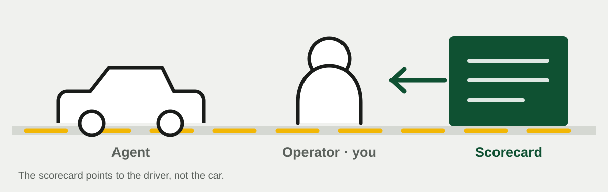
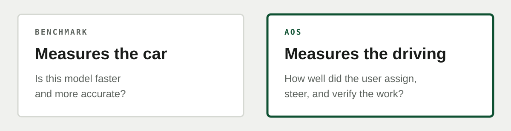
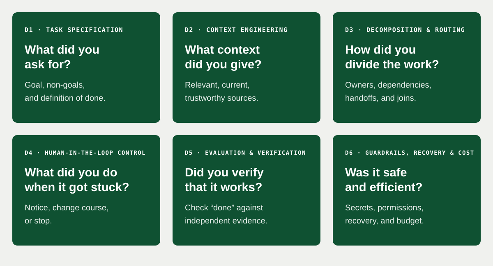
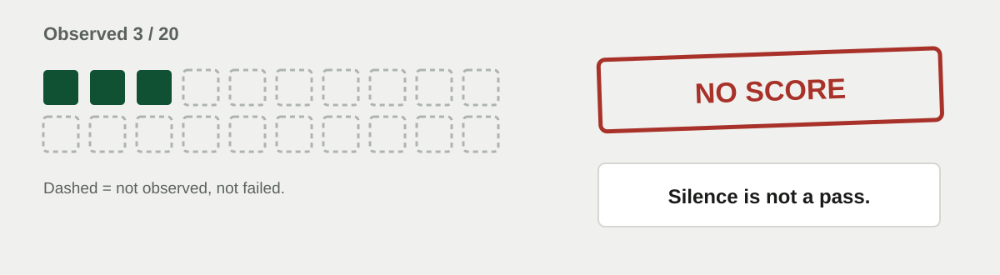
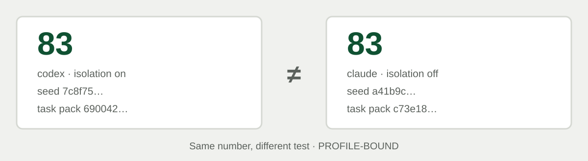

<div align="center">


# Agent Operator Score

**Not the car. The driver.**

[](https://github.com/MongLong0214/agent-operator-score/actions/workflows/ci.yml)
[](https://github.com/MongLong0214/agent-operator-score/releases)
[](package.json)
[](package.json)
[](docs/LIMITATIONS.md)
[](LICENSE)

<p align="center">
  <strong>English</strong> ·
  <a href="README.ko.md">한국어</a> ·
  <a href="README.ja.md">日本語</a> ·
  <a href="README.zh-CN.md">简体中文</a>
</p>

</div>

---


Most tools test the AI coding agent. AOS looks at **the person running it**.

That person is not the agent. It is the user — the **operator** — who gives the task, intervenes
when the work stalls, and decides whether the result is good enough to accept.

Two operators can give the same agent the same job and get very different outcomes. One states the
goal clearly, supplies the right context, changes course after a failure, and verifies “done” with
independent evidence. The other lets the same failure repeat or accepts an unverified completion
claim.

**AOS is a local tool for examining that difference.**



> [!WARNING]
> AOS is `EXPERIMENTAL / PROVISIONAL`. Its results are limited to the specific agent, model,
> configuration, machine, and task pack used. Do not use them for hiring, promotion, employee
> surveillance, or certification.

## Start here: run it from Claude Code

Claude Code users do not need to clone the repository or run `npm install`.

```
/plugin marketplace add MongLong0214/agent-operator-score
/plugin install aos@agent-operator-score

/aos-review
```

`/aos-review` reviews the session that just finished. It reads local records and does not call a
model, so it uses no model quota. `/aos-assess` runs agents again and therefore does consume quota.

The plugin removes repository cloning, manual agent registration, and hand-written plan setup.
It still requires Node `>=22.18 <25`, plus an installed and signed-in Claude Code or Codex CLI.

`/aos-assess` cannot make checkpoint decisions for you. To obtain an official score, follow its
instructions and answer the checkpoint questions in your own terminal. An agent answering on your
behalf would measure that agent's policy, not yours.

To run directly from the repository:

```bash
git clone --depth 1 --branch dev https://github.com/MongLong0214/agent-operator-score
cd agent-operator-score && npm ci

node bin/aos.mjs review
```

The default branch is `dev`. For an immutable, reproducible source snapshot, use a tag from
[GitHub Releases](https://github.com/MongLong0214/agent-operator-score/releases).

## What AOS measures: the driving, not the car

A conventional benchmark asks:

> Is this model faster or more accurate than another model?

AOS asks a different question:

> Given the tool, how well did the user assign, supervise, and verify the work?

In the analogy, the agent is the **car** and the operator is the **driver**. AOS does not measure
top speed. It checks whether the driver set the destination, noticed a wrong turn, stopped before an
unsafe action, and verified the arrival.



## Two modes: `review` and `assess`

| | `aos review` | `aos assess` |
|---|---|---|
| What it does | Finds potentially risky patterns in real sessions and presents them for human review | Runs six controlled tasks and summarizes the observed operation and outcome as a conditional score |
| Input | Local Codex, Claude Code, and Grok CLI transcripts | Registered agent CLIs such as Codex and Claude Code |
| Model quota | None; it only reads existing records | Yes; it runs the registered agents |
| Output | The suspicious step and supporting evidence | A score out of 100, or the exact reason no score was issued |

Start with `review`. It lets you inspect how AOS reasons about work you actually did, without
spending model quota.

### `review` — inspect work you already did

```bash
node bin/aos.mjs review                         # most recent session
node bin/aos.mjs review --since 12              # patterns across the latest 12 sessions
node bin/aos.mjs review --list                  # list reviewable session paths
node bin/aos.mjs review --session "<path>"       # review one path from the list
node bin/aos.mjs review --json                  # machine-readable JSON
```

A `review` result is a **candidate for inspection**, not a final verdict. Check it against the
original transcript.

| Rule | In plain English |
|---|---|
| `completion-claimed-without-verification` | The agent claimed completion after an edit, but nothing re-ran a test or verification |
| `session-ended-on-stale-evidence` | The session ended without fresh verification after the final edit |
| `edits-outside-the-working-directory` | The agent changed files outside the project it was working in |
| `destructive-command-executed` | A hard-to-reverse command with possible data loss was executed |
| `secret-material-in-session` | An API key, token, or private key appeared in the transcript |
| `long-uninterrupted-tool-run` | A long unattended stretch contained a failure or repeated the same action |
| `completion-claimed-over-a-failed-check` | The agent called the work done even though the preceding check failed |
| `verification-exit-status-discarded` | The check ran under `\|\| true`, which discarded its failure status |

One session answers “what happened this time?” Several sessions answer “what do I keep doing?”
The second view is where `review` becomes most useful.

The reviewer has not yet met its target accuracy in an independent measurement. Treat every finding
as something to verify, not as an automatic judgment.

### `assess` — exercise how you operate an agent

`assess` gives six controlled tasks to registered agents. The agent's own “done” message is not the
score. A separate verifier checks the artifacts and execution record, while AOS also observes what
the operator does at a blocker.

> [!CAUTION]
> When `aos init` finds Claude Code on `PATH`, it registers non-interactive execution with
> `--dangerously-skip-permissions`. This bypasses Claude Code's own permission prompts. AOS still
> keeps its temporary workspace, temporary `HOME`, and environment filtering, but you should
> understand this flag before running an assessment.

```bash
node bin/aos.mjs init                   # find Claude Code and Codex on PATH
node bin/aos.mjs doctor                 # check commands and known credential paths

node bin/aos.mjs assess                 # unattended diagnostic: no official score
node bin/aos.mjs assess --checkpoints   # attended run that can issue a score
```

`init` never overwrites an agent you configured yourself. When no plan is supplied, `assess` writes
and uses a complete default `aos-plan.json`. The plan is not a self-rating form, and its appearance
is not a scoring input.

`doctor` checks the executable and known credential path without calling the model. If an agent
never starts, or different task families fail in the same pre-task way, AOS stops instead of turning
a broken setup into a low operator score.

## The six things on the scorecard

AOS asks six practical questions.



1. **What did you ask for?** (`Task Specification`) — the goal, non-goals, and definition of done
2. **What context did you give?** (`Context Engineering`) — relevant, current, trustworthy sources
3. **How did you divide the work?** (`Decomposition & Routing`) — owners, dependencies, handoffs, joins
4. **What did you do when it got stuck?** (`Human-in-the-Loop Control`) — notice, change course, or stop
5. **Did you verify that it works?** (`Evaluation & Verification`) — check “done” against independent evidence
6. **Was it safe and efficient?** (`Guardrails, Recovery & Cost`) — secrets, permissions, recovery, and budget

These six dimensions contain 20 metrics. Every metric contains four named checks and records the
verifier, evidence, and reason behind its result.

## Checkpoints: what did you do when work got stuck?

When an agent repeats a failure or reaches a blocker, AOS pauses and shows the evidence.

```text
AOS checkpoint (1 of 3) — repeated-failure
blocked before this stage: the migration step times out
  repeated unchanged  retry-tests:retry-7

  | goal: cut the report over
  | latest evidence: sha256:67a666c03d22
  | event: retry-tests (retry-7)
  | event: retry-tests (retry-7)
  evidence 16368376f56a83d9

  y or Enter:
    Show the full evidence?
    Send it to another agent?
    Stop here?
    Change the instruction?
  answering no to all four retries the stage unchanged
  agents: codex
```

The checkpoint asks up to four yes/no questions, one at a time: show more evidence, reroute, stop,
or change the instruction. Enter means “no”. Answering no to all four retries the stage unchanged.

**The yes/no answer is not the score.** AOS grades the state it produced: whether the instruction
actually changed, the route actually moved, a stop really stopped, and the same failure returned.

Without `--checkpoints`, AOS cannot observe the operator's decisions. It keeps the diagnostic result
and provisional arithmetic, but the official score is withheld as `INCOMPLETE`. The same applies if
a plugin or another agent answers on the operator's behalf.

## Unobserved does not mean zero

Imagine a driving examiner never saw the parking exercise. Scoring parking as zero would collapse
“failed parking” and “parking was not observed” into the same claim.



AOS keeps them separate:

- **Failure**: the condition was checked and not met.
- **`NOT_OBSERVED`**: there was not enough evidence to decide.
- **`INCOMPLETE`**: too much was unobserved to issue an official score.

At least 18 of 20 metrics must be observed. Functional outcome, independent verification, exact
revision, completion integrity, recovery, and safety must also be observed. Empty artifacts and
silence do not earn credit. **Silence is not a pass.**

`provisional_raw` is debugging arithmetic for fixing the run. It is not an official score.

## Two 83s are not automatically comparable

An 83 earned with a different car, course, and weather is a different test. AOS scores work the same
way.



The meaning of a score changes with:

- the agent and model
- CLI version and execution configuration
- machine and isolation level
- task pack and seed

AOS records those conditions with the result. This is `PROFILE-BOUND`: scores from different
profiles describe different measurements and should not be compared directly.

| AOS is not | Why |
|---|---|
| A general score of a person's AI ability | It observes one bounded environment and task pack |
| A universal model, CLI, or harness benchmark | Different profiles are different tests |
| A percentile, rank, or certification | There is no reference population or norm |
| A hiring, promotion, or employee-surveillance tool | The intended-use policy forbids adverse personnel use |
| A SaaS or telemetry service | Runs and reports stay local; AOS has no collection service |
| A validated scientific instrument | Calibration, independent reproduction, and qualified review are not complete |

An early version scored 17 of 20 metrics from the shape of an operator-written JSON plan; a
meaningless plan could receive `17/17`. That design is gone. The plan is not a scoring input, and a
metric is now observed from the run or left `NOT_OBSERVED`.

The scenarios and grading logic are public in `lib/suite.mjs`. AOS is therefore a practice and
self-inspection tool, not a secret-answer exam.

## Why three runs become one score

One run can move because of model variance and chance. AOS locks three seeds at the start and groups
three runs made under the same profile into one cycle.

```bash
node bin/aos.mjs cycle start                                  # lock three seeds
node bin/aos.mjs cycle run --checkpoints                      # run them in order
node bin/aos.mjs cycle                                        # median of valid runs
node bin/aos.mjs dashboard                                    # local read-only dashboard
```

Only three of the six task families currently vary with the seed. Three local repetitions therefore
do not establish population-level confidence or general ability.

A run counts only when it uses the locked seed, unchanged profile, suite major, and scorer major,
and has both a committed terminal record and an issued score. Invalid runs are listed with their
reason. A valid low score cannot be discarded or rerun on the same seed.

If the cycle was configured incorrectly, `--force --reason "<why>"` abandons it and starts another.
The old cycle, seeds, runs, and scores remain recorded.

The Operator Score is the median of all valid runs. Spread, median absolute deviation, and
**local repeat evidence** describe repetition on this one machine; AOS does not call that
statistical confidence.

## When there is no score — and when a ceiling applies

AOS does not issue a score merely because arithmetic is possible. Insufficiently observed runs stay
`INCOMPLETE`.

When a critical violation is actually observed, AOS applies a **maximum**, not an ordinary
deduction:

- secret exposure, prohibited external action, or workspace escape: maximum 39
- completion claimed over a hidden failure: maximum 49
- a critical error ignored or a failed recovery route blindly retried: maximum 59
- the verified revision and final revision do not match: maximum 69

For example, a run that exposed a secret cannot score above 39, no matter how well it performed
elsewhere. The violation cannot be averaged away.

A ceiling applies only when the violation was observed. Missing evidence is `INCOMPLETE`, not
`UNSAFE`. Bands — `HIGH RELIABILITY`, `ADVANCED`, `OPERATIONAL`, `DEVELOPING`, and `FRAGILE` —
summarize that run only; they are not a ranking of the person.

## What has actually been measured

These are real Codex runs on one machine. Each cycle used three locked seeds and an operator attended
every checkpoint.

| Cycle | Agent sandbox | Operator Score | Run scores | Spread |
|---|---|---|---|---|
| 1 | On | **69** | 69, 69, 83 | 14 |
| 2 | Off | *Withdrawn* | 49, 59, 89 | — |
| 3 | Off | **90** | 90, 87, 92 | 5 |

“Agent sandbox” means Codex's own command sandbox. AOS's temporary workspace, replaced `HOME`, and
environment filtering remained in place in every cycle.

Cycle 2 was withdrawn because one run's score was recorded against all three seeds — one run counted
three times. Its individual scores remain, and the three defects they exposed were fixed before
cycle 3.

`aos review` was measured once on 320 sessions that had not been used to write its rules.
**4 of 10 high-severity findings were correct: precision 0.400.** The six false positives were
fixed, but checking those fixes on the same sessions is tuning, not a second independent
measurement.

```bash
node bin/aos.mjs holdout --session <path> --use holdout
node bin/aos.mjs holdout --session <path> --finding <id> --verdict false-positive --reason "..."
node bin/aos.mjs holdout
```

Until new, unused sessions are measured, the current reviewer's accuracy is not established. The
holdout ledger stores session digests, finding IDs, judgments, and reasons — never transcripts.
See [`docs/LIMITATIONS.md`](docs/LIMITATIONS.md).

## Outputs, security, and privacy

An assessment produces:

- **`card.svg`** — one image with the score, six dimensions, conditions, and the first thing to fix
- **Markdown and HTML reports** — metric-level evidence, failures, unobserved items, blockers, and ceilings
- **JSON** — the machine-readable result

A card for a run without an issued score says **NO SCORE** and gives the reason. It never presents
`provisional_raw` as a shareable score.

The report can be regenerated with
`node bin/aos.mjs report --run <id> --format markdown|html|json`. The HTML report and scorecard
currently render in Korean for a Korean locale and in English for every other locale. Japanese and
Chinese report UI are not yet localized.

| Area | Actual behavior |
|---|---|
| AOS networking | The dashboard binds to `127.0.0.1`, requires a token, and is read-only and GET-only. No route returns a transcript, and AOS has no external collection client |
| Agent networking | Codex and Claude Code may contact their model providers during `assess`; this is not an offline run |
| Dependencies | There are no runtime package dependencies, but a supported Node runtime is required |
| Agent environment | AOS replaces `HOME`, filters sensitive variables, and removes the operator's existing `AOS_*` values including `AOS_HOME` |
| Run context and credentials | AOS injects only `AOS_SESSION_ID`, `AOS_FAMILY`, `AOS_WORKSPACE`, and `AOS_TASK_FILE`, plus an explicitly allowed or supported runtime credential. Names and sources may be recorded; values are not |
| Secrets and local storage | Secret values are redacted where output is read. `~/.aos` is mode `0700`; files inside are mode `0600` |

Automatic credential discovery can be disabled with `--no-auto-auth`. Report security issues
through [`SECURITY.md`](SECURITY.md).

## Run it directly, contribute, and read more

Direct execution requires Node `>=22.18 <25`, native macOS or Linux, and x64 or arm64. WSL is not
supported. Nothing is installed globally, and no package is published to a registry.

```bash
npm ci
npm test                 # full test suite
npm run verify:mvp       # score contract, ceilings, and bands
npm run test:mutation    # prove the named guards are load-bearing
npm run smoke:package    # pack and exercise the user flow elsewhere
```

CI runs the test suite on Ubuntu with Node 22 and 24 and on macOS with Node 24, plus separate
`verify:mvp`, mutation, and package-smoke jobs for Ubuntu and macOS.

| Document | Purpose |
|---|---|
| [`docs/LIMITATIONS.md`](docs/LIMITATIONS.md) | What has not been established and what every result is bound to |
| [`docs/INTENDED_USE.md`](docs/INTENDED_USE.md) | Allowed and prohibited uses |
| [`CONTRIBUTING.md`](CONTRIBUTING.md) | Branch model, evidence required for changes, and DCO |
| [`SECURITY.md`](SECURITY.md) | Private vulnerability-reporting process |
| [`THIRD_PARTY_NOTICES.md`](THIRD_PARTY_NOTICES.md) | Third-party notices |

MIT — see [`LICENSE`](LICENSE). Contributions follow the
[Developer Certificate of Origin](CONTRIBUTING.md); sign commits with `git commit -s`.
