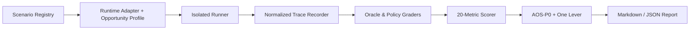

# AgentOps Score (AOS)

[](https://github.com/MongLong0214/AgentOps-Score/actions/workflows/ci.yml)

**An open assessment for human agent operations. Declared environment. Real tasks. Traceable evidence. Actionable improvement.**

AgentOps Score is a planned local-first tool for measuring how effectively a human operator turns goals into verified, safe, repeatable outcomes with coding agents. It evaluates the operator in a declared Opportunity Profile—not the model alone, prompt length, tool count, or installed harness.

> **Current status: planning baseline.** The repository contains accepted identity/architecture decisions, production PRDs, 35 atomic implementation tickets, milestones, and planning-only CI. The `agentops-score` package, `aos` CLI, scorer, runner, adapters, and assessment forms are **not implemented or published yet**.

## Why AOS

AOS is designed to answer five questions:

1. What is my current evidence-backed operating level?
2. What evidence produced that result?
3. Where does my workflow lose the most performance?
4. Which single change is most likely to help?
5. Does that improvement transfer to a different task form?

The initial method freezes 20 metrics across intent, context, orchestration, state, verification, recovery, governance, and value. Safety is a hard gate, not an averageable score.

## Technology stack

| Layer | Decision |
|---|---|
| Runtime | Node.js 20+; CI floor and current LTS lanes |
| Language | Strict TypeScript |
| Distribution | Planned npm package `agentops-score`, binary `aos` |
| Data contracts | JSON Schema and canonical JSON |
| Storage | Local `.aos/`; telemetry off |
| Supported runtimes | Planned Codex and Claude Code adapters |

See [ADR-0003](docs/adr/0003-runtime-and-distribution.md) and [.github/copilot/Technology_Stack.md](.github/copilot/Technology_Stack.md).

## Architecture



Missing adapter observability blocks affected metrics or the score; it is never reinterpreted as poor operator performance. Deterministic oracles outrank model judges. See [Architecture](.github/copilot/Architecture.md).

## Getting started

### Inspect the planning baseline

```bash
git clone https://github.com/MongLong0214/AgentOps-Score.git
cd AgentOps-Score
npm ci
npm test
npm run build
```

These commands validate the repository's Phase 4 planning contracts. They do not run an AOS assessment.

### Planned CLI — not available yet

The following interface is the accepted product target and must not be treated as working installation instructions:

```text
npx agentops-score fixtures verify
npx agentops-score doctor --capabilities --runtime codex
npx agentops-score assess --runtime codex --suite coding-core-v0 --form A
npx agentops-score report --run ./runs/<id>
```

Implementation begins at [T-001](docs/tickets/F0-preflight-contracts.md#t-001-freeze-m01m20-registry-m), not at the CLI surface.

## Project structure

```text
docs/adr/          accepted decisions and rejected alternatives
docs/prd/          feature requirements and acceptance criteria
docs/tickets/      35 atomic TDD execution tickets and dependency graph
docs/north-star/   final product planning baseline
docs/research/     adverse evidence, feasibility, citations
.github/copilot/   architecture, stack, workflow, standards, tests
.github/workflows/ planning-only CI skeleton
scripts/           repository planning-contract validation
tests/             planning-contract tests
```

The planned product layout adds `packages/`, `adapters/`, `suites/`, `fixtures/`, `specs/`, and `conformance/` only through approved issues.

## Planned capabilities

- Versioned Opportunity Profiles for runtime, model, harness, tool, permission, and budget conditions
- 20 evidence-bound metrics across six assessment families
- AOS-P0 with coverage rules and an M19 safety hard gate
- Isolated local runner with fault, budget, retry, and stale-evidence semantics
- Codex and Claude Code capability-aware adapters
- Deterministic scorer and public conformance fixtures
- `PROVISIONAL` Verified Core, `ESTIMATE` Snapshot, and one-lever Form B retest
- Local-only data by default and explicit anonymous export only

No percentile, certification, hiring claim, public personal leaderboard, account, payment, central user database, or default telemetry is in scope.

## Development workflow

- Default integration branch: `dev`; release branch: `main`.
- Work starts from a GitHub issue on `feat-issue-<id>` or `bug-issue-<id>`.
- Every ticket uses RED → minimum GREEN → focused → full → build/package → manual/LIVE_NA → review → exact-head CI.
- Candidate-head changes invalidate affected evidence.
- Product implementation cannot start until its ADR, PRD, and atomic ticket gates are accepted.

See [Workflow Analysis](.github/copilot/Workflow_Analysis.md) and the [ticket dependency graph](docs/tickets/TICKETS.md).

## Coding standards

- Strict types at trust boundaries; no silent fallback or unknown coercion.
- Deterministic-first grading and canonical serialization.
- Explicit terminal reasons, observability status, redaction state, and provenance.
- Minimum privilege, wrong-target checks, idempotency, and partial-state handling.
- No hidden chain-of-thought or secret values in traces.

See [Coding Standards](.github/copilot/Coding_Standards.md).

## Testing

Current CI validates planning completeness on Node.js 20 and 24. Product tickets require unit, property, conformance, mutation, integration, security/privacy, and manual/live evidence as applicable. A passing test is insufficient when the test could not observe its target.

See [Unit Tests](.github/copilot/Unit_Tests.md) and [ADR-0010](docs/adr/0010-validation-and-stop-rules.md).

## Contributing

Start with [CONTRIBUTING.md](CONTRIBUTING.md), then select an unblocked issue from the earliest milestone. Do not implement a later ticket around a failed or unverified dependency. New metrics and runtimes are frozen outside the 90-day critical path.

## Intended use and limitations

AOS is intended for personal improvement in coding-agent operations. The future score remains `PROVISIONAL` until calibration gates pass. Local OSS cannot guarantee credential-grade anti-cheat security. Hiring, promotion, surveillance, certification, and industry-standard claims are out of scope.

The accepted north-star is [agentops-score-ssot-v1.0.md](docs/north-star/agentops-score-ssot-v1.0.md).

## License

No OSS license has been selected yet. The repository stays private and is not ready for redistribution until [T-804](docs/tickets/F8-validation-and-public-oss.md#t-804-decide-licensenotices-and-enforce-publication-gate-m) records the license, third-party notices, and publication approval.

