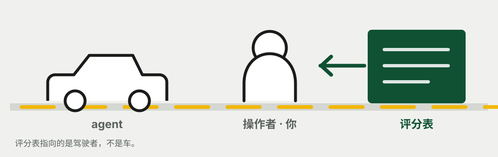
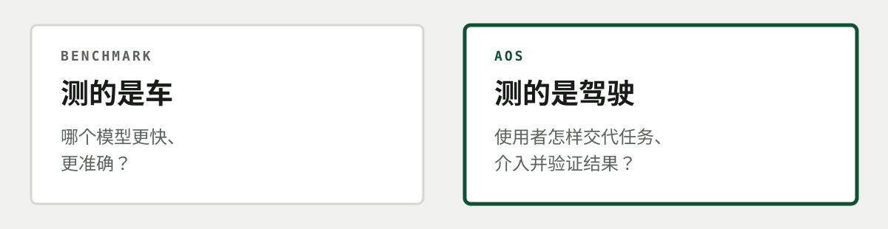
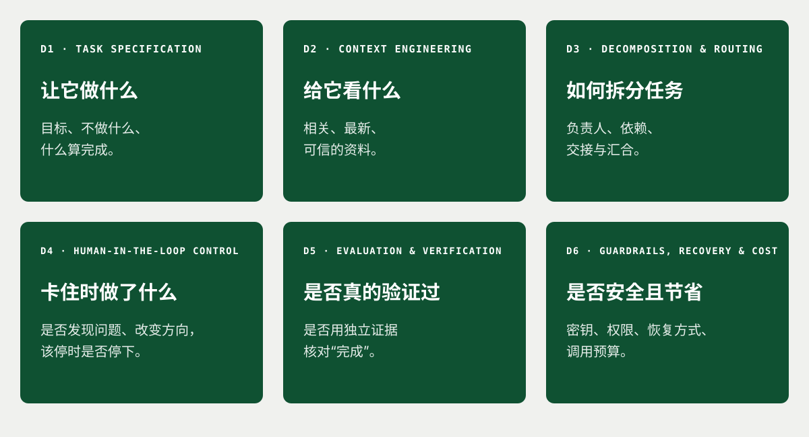
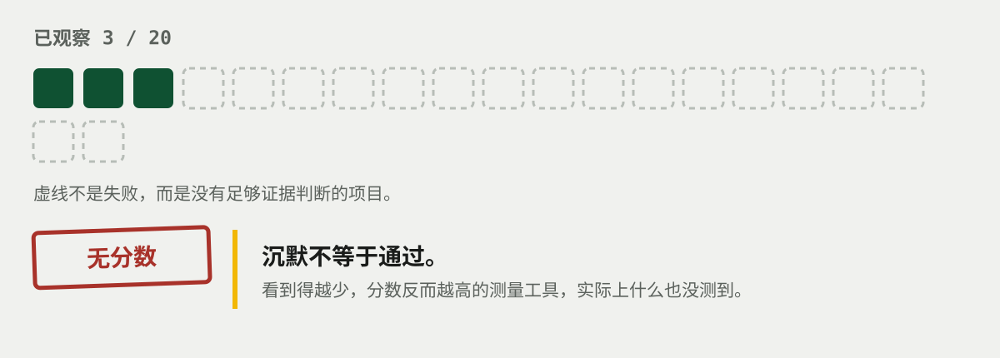
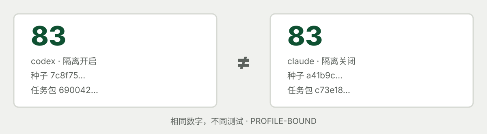

<div align="center">


# Agent Operator Score

**看的不是车，而是开车的人。**

[](https://github.com/MongLong0214/agent-operator-score/actions/workflows/ci.yml)
[](https://github.com/MongLong0214/agent-operator-score/releases)
[](package.json)
[](package.json)
[](docs/LIMITATIONS.md)
[](LICENSE)

<p align="center">
  <a href="README.md">English</a> ·
  <a href="README.ko.md">한국어</a> ·
  <a href="README.ja.md">日本語</a> ·
  <strong>简体中文</strong>
</p>

</div>

---


评测 AI 编程 Agent 本身的工具很多。AOS 关注的是**使用它的人**。

这里的“人”不是 Agent，而是给它分配任务、在工作卡住时介入、决定结果能否接受的**用户**，
也就是操作者（operator）。

同一个 Agent 做同一个任务，结果仍可能完全不同。有的操作者会说清目标，只提供必要资料，
失败后改变方向，并用独立证据核对“已经完成”。也有人让同一种失败不断重复，或直接接受未经
验证的完成报告。

**AOS 是用来检查这种差异的本地工具。**



> [!WARNING]
> AOS 目前是 `EXPERIMENTAL / PROVISIONAL`。结果只适用于当次使用的 Agent、模型、配置、
> 机器和任务包。请勿将其用于招聘、晋升、员工监控或资格认证。

## 先从 Claude Code 里运行

使用 Claude Code 时，不需要克隆仓库，也不需要执行 `npm install`。

```
/plugin marketplace add MongLong0214/agent-operator-score
/plugin install aos@agent-operator-score

/aos-review
```

`/aos-review` 会回看刚结束的会话。它只读取本地记录，不调用模型，因此不消耗模型额度。
`/aos-assess` 会重新运行 Agent，所以会消耗额度。

插件省去了克隆仓库、手动注册 Agent 和手写计划文件。不过仍然需要 Node `>=22.18 <25`，
以及已经安装并登录的 Claude Code 或 Codex CLI。

`/aos-assess` 不能替你回答检查点问题。要获得正式分数，请按提示在自己的终端里作答。
如果由 Agent 代答，测到的将是 Agent 的策略，而不是你的判断。

从仓库直接运行：

```bash
git clone --depth 1 --branch dev https://github.com/MongLong0214/agent-operator-score
cd agent-operator-score && npm ci

node bin/aos.mjs review
```

默认分支是 `dev`。需要日后精确复现同一份源码时，请使用
[GitHub Releases](https://github.com/MongLong0214/agent-operator-score/releases) 中的标签。

## AOS 测的是什么：不是车，而是驾驶方式

常见基准测试会问：

> 这个模型是否比另一个模型更快、更准确？

AOS 问的是另一件事：

> 使用同一个工具时，用户是否把任务交代清楚、持续监督，并验证了结果？

打个比方，Agent 是**车**，操作者是**驾驶者**。AOS 不测最高时速，而是看驾驶者是否设定了
正确目的地、发现走错路、在危险操作前停下，并在到达后确认结果确实正确。



## 两种功能：`review` 与 `assess`

| | `aos review` | `aos assess` |
|---|---|---|
| 做什么 | 从真实会话中找出可能有风险的模式，作为人工复核候选 | 运行六个受控任务，用受条件约束的分数概括操作过程与结果 |
| 对象 | 本地保存的 Codex、Claude Code、Grok CLI 会话记录 | 已注册的 Codex、Claude Code 等 Agent CLI |
| 模型额度 | 不消耗，只读取已有记录 | 会消耗，因为会实际运行 Agent |
| 结果 | 可疑步骤与支持证据 | 百分制分数，或未签发分数的准确原因 |

建议先使用 `review`。它不会消耗模型额度，可以先用自己的真实工作记录理解 AOS 的判断方式，
再决定是否运行 `assess`。

### `review` — 回看已经完成的工作

```bash
node bin/aos.mjs review                         # 最近一次会话
node bin/aos.mjs review --since 12              # 最近 12 次会话中的重复模式
node bin/aos.mjs review --list                  # 列出可检查的会话路径
node bin/aos.mjs review --session "<路径>"      # 检查列表中的指定会话
node bin/aos.mjs review --json                  # 输出 JSON
```

`review` 给出的不是最终判决，而是**需要人工核对的候选项**。请对照原始会话确认是否真的成立。

| 规则 | 简单来说 |
|---|---|
| `completion-claimed-without-verification` | Agent 修改文件后没有重新测试或验证，却声称已经完成 |
| `session-ended-on-stale-evidence` | 最后一次修改之后没有新验证证据，会话就结束了 |
| `edits-outside-the-working-directory` | Agent 修改了当前项目目录之外的文件 |
| `destructive-command-executed` | 执行了可能导致数据丢失、难以撤销的命令 |
| `secret-material-in-session` | 会话中出现了 API Key、令牌或私钥等敏感值 |
| `long-uninterrupted-tool-run` | 长时间无人介入的执行中发生了失败或重复操作 |
| `completion-claimed-over-a-failed-check` | 前一次检查已经失败，Agent 仍声称工作完成 |
| `verification-exit-status-discarded` | 验证命令后加了 `\|\| true`，把失败状态丢掉了 |

单次会话回答“这次发生了什么”；多次会话更容易看出“我反复在做什么”。后者是 `review`
更有价值的用法。

当前 `review` 规则在独立测量中尚未达到目标准确率。所有提示都应视为人工核对候选，
而不是自动裁决。

### `assess` — 用练习任务检查操作方式

`assess` 会让 Agent 实际执行 AOS 准备的六个任务。Agent 说“完成了”并不会自动得分。
独立验证器会检查产物和执行记录，AOS 也会观察操作者在工作受阻时如何判断。

> [!CAUTION]
> 当 `aos init` 在 `PATH` 中找到 Claude Code 时，会用
> `--dangerously-skip-permissions` 注册非交互运行。这会跳过 Claude Code 自身的权限确认。
> AOS 的临时工作区、临时 `HOME` 和环境变量过滤仍然存在，但请先理解该参数再运行评估。

```bash
node bin/aos.mjs init                   # 从 PATH 自动注册 Claude Code 和 Codex
node bin/aos.mjs doctor                 # 检查命令与已知凭据路径

node bin/aos.mjs assess                 # 无人诊断：不会签发正式分数
node bin/aos.mjs assess --checkpoints   # 操作者亲自参与、可签发分数的运行
```

`init` 不会覆盖用户自己配置的 Agent。未指定计划文件时，`assess` 会生成并使用可直接运行的
默认 `aos-plan.json`。计划文件不是自评问卷，其写法是否漂亮也不会计入分数。

`doctor` 会检查可执行文件和已知凭据路径，但不会调用模型。如果 Agent 根本没有启动，或者不同
任务在工作开始前以完全相同的方式失败，AOS 会停止，而不会把错误配置算成操作者低分。

## 评分卡上的六个问题

AOS 关注下面六件事。



1. **让它做什么** (`Task Specification`) — 目标、不做什么、什么算完成
2. **给它看什么** (`Context Engineering`) — 相关、最新、可信的资料
3. **如何拆分任务** (`Decomposition & Routing`) — 负责人、依赖、交接、汇合
4. **卡住时做了什么** (`Human-in-the-Loop Control`) — 发现问题、改变方向或停止
5. **是否真的验证过** (`Evaluation & Verification`) — 用独立证据核对“完成”
6. **是否安全且节省** (`Guardrails, Recovery & Cost`) — 密钥、权限、恢复、调用预算

六个维度下共有 20 项指标。每项指标由四个明确检查组成，并记录验证器、证据和判定理由。

## 检查点：卡住时做了什么

当 Agent 重复同一种失败，或无法继续前进时，AOS 会暂时停下并显示证据。

```text
AOS checkpoint (1 of 3) — repeated-failure
blocked before this stage: the migration step times out
  repeated unchanged  retry-tests:retry-7

  | goal: cut the report over
  | latest evidence: sha256:67a666c03d22
  | event: retry-tests (retry-7)
  | event: retry-tests (retry-7)
  evidence 16368376f56a83d9

  y or Enter:
    Show the full evidence?
    Send it to another agent?
    Stop here?
    Change the instruction?
  answering no to all four retries the stage unchanged
  agents: codex
```

检查点会依次用“是／否”询问：是否查看完整证据、是否转交另一个 Agent、是否在此停止、
是否修改指令。按 Enter 表示“否”。四个问题全部回答“否”时，会按原状态重试该阶段。

**“是／否”本身不是分数。** AOS 看的是回答造成的实际状态变化：指令是否真的改变、路线是否
真的切换、选择停止后是否真的停止，以及同一种失败是否再次出现。

不加 `--checkpoints` 就无法观察操作者的判断。诊断结果和临时计算值会保留，但正式分数会以
`INCOMPLETE` 状态扣留。插件或另一个 Agent 代答也一样。

## 没观察到，不等于 0 分

假设驾考考官没有机会看到停车项目。把它记成 0 分，会把“停车失败”和“没有观察到停车”
混成同一件事。



AOS 会区分：

- **失败**：已经检查，条件没有满足。
- **`NOT_OBSERVED`**：没有足够证据作出判断。
- **`INCOMPLETE`**：重要项目观察不足，因此不签发正式分数。

20 项指标中至少要观察到 18 项；功能结果、独立验证、最终版本、完成声明、恢复与安全这些必需
指标也必须可观察。空产物和沉默不会得分。**沉默不等于通过。**

`provisional_raw` 只是排查运行问题时参考的临时计算值，不是正式分数。

## 两个 83 分不能直接比较

不同车辆、路线和天气下得到的两个 83 分，不是同一场考试。AOS 分数也是如此。



分数含义会随以下条件变化：

- 使用的 Agent 与模型
- CLI 版本与执行配置
- 机器与隔离级别
- 任务包与种子

AOS 会把这些条件与结果一起记录。这就是 `PROFILE-BOUND`：不同配置下的分数描述的是不同测量，
不能直接比较。

| AOS 不是什么 | 原因 |
|---|---|
| 一个人综合 AI 能力的总分 | 它只观察一个受限环境和任务包 |
| 模型、CLI 或 Harness 的通用优劣基准 | 配置不同就是不同考试 |
| 百分位、排名或认证 | 没有参考总体或常模 |
| 招聘、晋升或员工监控工具 | 预期用途明确禁止对人员造成不利影响的使用 |
| SaaS 或遥测服务 | 运行记录与报告留在本地，AOS 没有收集服务 |
| 已验证的科学测量工具 | 校准、独立复现和专业评审尚未完成 |

早期版本曾根据操作者填写的 JSON 计划文件形状，直接决定 20 项指标中的 17 项；一份没有实际
内容的计划也可能得到 `17/17`。现在计划文件不再是评分输入，指标只能从运行中被观察到，
否则保持 `NOT_OBSERVED`。

任务与评分逻辑公开在 `lib/suite.mjs`。AOS 因此是练习与自查工具，不是靠猜隐藏答案的考试。

## 为什么运行三次后合成一个分数

单次运行会受模型波动和偶然因素影响。AOS 会在开始时锁定三个种子，并把同一配置下的三次运行
组成一个周期。

```bash
node bin/aos.mjs cycle start                                  # 锁定三个种子
node bin/aos.mjs cycle run --checkpoints                      # 按顺序运行
node bin/aos.mjs cycle                                        # 有效运行的中位数
node bin/aos.mjs dashboard                                    # 本机只读面板
```

目前六个任务中只有三个会随种子改变细节。因此，三次本地重复不能被扩大解释为总体层面的统计
置信度，也不能证明通用能力。

只有使用锁定种子、相同 Profile、相同 suite major 和 scorer major，并且具备终止记录与正式
分数的运行才会进入汇总。被排除的运行会显示原因。有效低分不能被丢弃，也不能用同一种子重跑。

如果周期配置错误，可以用 `--force --reason "<原因>"` 终止并重新开始。旧周期、种子、运行和
分数不会删除。

Operator Score 是所有有效运行的**中位数**。极差、中位绝对偏差（MAD）和
**local repeat evidence** 只描述这台机器上的重复波动；AOS 不把它称为统计
`confidence`。

## 没有分数与分数上限

AOS 不会因为能做算术就一定签发正式分数。观察不足的运行会保持 `INCOMPLETE`。

如果实际观察到严重违规，AOS 不采用普通扣分，而是限制分数的**最高值**：

- 泄露敏感信息、执行禁止的外部操作或越出工作区：最高 39 分
- 隐藏验证已经失败，仍声称完成：最高 49 分
- 忽略严重错误，或盲目重试已经失败的恢复路线：最高 59 分
- 被验证的版本与最终版本不一致：最高 69 分

例如，泄露敏感信息的运行无论其他部分多好，都不能超过 39 分。严重问题不能被其他高分平均掉。

只有确实观察到违规时才应用上限。证据不足的运行是 `INCOMPLETE`，不是 `UNSAFE`。
`HIGH RELIABILITY`、`ADVANCED`、`OPERATIONAL`、`DEVELOPING`、`FRAGILE` 只概括当次运行，
不代表一个人的整体能力或行业排名。

## 已有实测结果与当前限制

下面是使用真实 Codex 在一台机器上的运行案例。每个周期包含三个锁定种子，所有检查点都有
操作者参与。

| 周期 | Agent 沙箱 | Operator Score | 各次分数 | 极差 |
|---|---|---|---|---|
| 1 | 开 | **69** | 69, 69, 83 | 14 |
| 2 | 关 | *已撤回* | 49, 59, 89 | — |
| 3 | 关 | **90** | 90, 87, 92 | 5 |

“Agent 沙箱”指 Codex 自身的命令执行限制。AOS 的临时工作区、替换后的 `HOME` 和环境变量过滤
在三个周期中都保持启用。

周期 2 的汇总分数已撤回，因为一次运行的分数被记录到三个种子上，相当于把同一次运行算了三遍。
各次分数仍保留，其中暴露出的三个缺陷已在周期 3 前修复。

`aos review` 曾在 320 个未用于编写规则的会话上进行过一次测量。
**10 条高严重度提示中 4 条正确，精确率为 0.400。** 六个误报后来已修复，但用同一批会话检查
修复结果属于调参，不是第二次独立测量。

```bash
node bin/aos.mjs holdout --session <path> --use holdout
node bin/aos.mjs holdout --session <path> --finding <id> --verdict false-positive --reason "..."
node bin/aos.mjs holdout
node bin/aos.mjs holdout --lanes
```

`aos holdout --lanes` 会同时报告两条通道：本地留出集的精确率，以及 `fixtures/known-incidents/`
中已知事件夹具的精确率与召回率。低于下限（留出会话 50 个、已判定的高严重度提示 20 条、这些判定
跨越至少 10 个不同会话、且存疑判定不多于已定判定）时，比率不会打印而是被扣留，`aos review` 仍为
EXPERIMENTAL。扣留意味着没有该值，而不是 0；该命令打印的每一份报告都由应用下限后的结果生成。
这些下限是声明的产品验收阈值，并非统计推导所得，夹具集合也是由编写规则的同一人重建的 —— 详见
[`docs/LIMITATIONS.md`](docs/LIMITATIONS.md)。

在新的、未使用过的会话上重新测量之前，不能声称当前 `review` 的准确率已经确立。holdout 台账
只保存会话哈希、提示 ID、人工判定与理由，不保存会话正文。详见
[`docs/LIMITATIONS.md`](docs/LIMITATIONS.md)。

## 输出、安全与隐私

`assess` 完成后会生成：

- **`card.svg`** — 在一张图中显示分数、六个维度、运行条件和最先应修复的一项
- **Markdown 与 HTML 报告** — 指标级证据、失败、未观察项、扣留原因与上限
- **JSON 结果** — 供其他工具读取的原始数据

未签发正式分数时，卡片会显示 **NO SCORE** 和原因，不会把 `provisional_raw` 当作可分享分数。

可用 `node bin/aos.mjs report --run <id> --format markdown|html|json` 重新生成报告。HTML 报告与
评分卡在韩语 Locale 下显示韩语，其他 Locale 下显示英语。目前尚无日语或中文报告界面。

| 项目 | 实际行为 |
|---|---|
| AOS 自身网络 | 面板只绑定 `127.0.0.1`，需要令牌，只读且仅接受 GET。没有返回会话正文的路由，AOS 也没有外部收集客户端 |
| Agent 网络 | `assess` 中的 Codex 和 Claude Code 可能连接各自的模型提供方；这不是完全离线运行 |
| 依赖 | 没有运行时包依赖，但需要受支持的 Node |
| Agent 环境 | AOS 会替换 `HOME`。默认的 `BEST_EFFORT_CLI` 模式会保留普通的非敏感环境变量，移除名称看起来敏感的变量以及用户原有的 `AOS_*`、`AOS_HOME`，再加入四个运行上下文变量 |
| 运行信息与凭据 | 新加入的 AOS 变量是 `AOS_SESSION_ID`、`AOS_FAMILY`、`AOS_WORKSPACE`、`AOS_TASK_FILE`。明确允许的变量和已支持的运行时凭据也可能被传入。可以记录名称与来源，但不会保存凭据值 |
| 敏感值与本地存储 | 输出中的敏感值在读取时被移除。`~/.aos` 权限为 `0700`，其中的文件为 `0600` |

可用 `--no-auto-auth` 关闭凭据自动发现。安全问题请按
[`SECURITY.md`](SECURITY.md) 中的流程报告。

## 直接运行、开发与相关文档

直接运行需要 Node `>=22.18 <25`、原生 macOS 或 Linux，以及 x64 或 arm64。暂不支持 WSL。
无需全局安装，也没有发布到 npm Registry 的包。

```bash
npm ci
npm test                 # 全部测试
npm run verify:mvp       # 验证评分契约、上限和等级
npm run test:mutation    # 破坏守卫时，对应测试必须失败
npm run smoke:package    # 打包到其他位置，验证真实使用流程
```

CI 会在 Ubuntu 的 Node 22、24 与 macOS 的 Node 24 上运行全部测试，并单独运行 `verify:mvp`、
变异测试，以及 Ubuntu、macOS 的包冒烟测试。

| 文档 | 内容 |
|---|---|
| [`docs/LIMITATIONS.md`](docs/LIMITATIONS.md) | 尚未确立的结论，以及每项结果受哪些条件约束 |
| [`docs/INTENDED_USE.md`](docs/INTENDED_USE.md) | 允许与禁止的使用方式 |
| [`CONTRIBUTING.md`](CONTRIBUTING.md) | 分支策略、变更所需证据、DCO |
| [`SECURITY.md`](SECURITY.md) | 私下报告安全漏洞的流程 |
| [`THIRD_PARTY_NOTICES.md`](THIRD_PARTY_NOTICES.md) | 第三方声明 |

MIT License，详见 [`LICENSE`](LICENSE)。贡献需遵循
[Developer Certificate of Origin](CONTRIBUTING.md)，并使用 `git commit -s` 签名。
