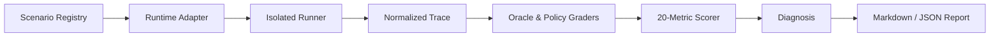

# AgentOps Score — Phase 0–2 dossier

- Date: 2026-08-05
- Factory tier: M
- Input: raw product plan, marked `FINAL / SINGLE SOURCE OF TRUTH / OSS BUILD BASELINE`
- Owner-confirm evidence: the owner supplied that final plan in response to the Phase 0 gate and explicitly directed repository creation through ADR, PRD, tickets, milestones, issues, branches, and CI.

## Executive summary

**Substance.** AgentOps Score (AOS) is a planned local-first assessment for the human operator of coding agents. It does not yet have a calibrated instrument, an implemented scorer, human alpha data, or a distributable package. The honest public label is therefore `PROVISIONAL`, with no percentile, certification, hiring, or industry-standard claim.

**What is still right.** The strongest product insight is the separation of environment opportunity from human operating contribution, combined with evidence-bound scoring and a safety gate. This makes the project materially different from model leaderboards, prompt quizzes, and tool-installation checks.

**Build direction.** The project must begin with preflight measurement contracts, schemas, deterministic fixtures, and scorer truth. Runner, adapters, task packs, reports, human alpha, and public release follow only after their preceding gates pass. Public release remains blocked until license, notices, external reproduction, and measurement limitations are closed.

**Difference in one line:** AOS evaluates how a person operates agents in a declared environment, using tasks and trace evidence, then prescribes one testable improvement lever.

## Phase 0 decisions

| Decision | Locked value | Evidence |
|---|---|---|
| Deadline | 90-day S0–S4 window, ending 2026-11-03 KST | North-star §§12–13 |
| Revenue model | Free; no paid SKU, SaaS, or enterprise plan | North-star §§0.4, 2.1, 16 |
| Visibility | Public OSS target; repository remains private until the S4 public-transition gate | North-star §§9.6, 13; repo-factory publication gate |
| Originality | Independent product design; cited systems are evidence and do not donate identity or protocol vocabulary | North-star §§1, 10, 16 |

## Adverse evidence first

| Risk | Adverse evidence | Design response | Earliest falsification |
|---|---|---|---|
| The instrument measures tasks or models, not people | Performance assessments trade realism against score reliability; task, occasion, and rater variance can dominate person variance. | G1 explicitly requires person signal greater than task/session noise and permits abandoning the 0–100 score. | T-802 human-alpha variance study |
| Judge bias silently becomes user ability | LLM judges exhibit position, style, and verbosity effects; mitigation is task-dependent. | Deterministic oracle precedence, answer-order swap, padding tests, abstention, blinded human coding. | T-204 fixtures; T-803 judge reliability |
| Public tasks become memorization tests | Public agent benchmarks can contain shortcuts, weak oracles, and contamination. | Demo fixtures are never scored tasks; Form A/B repositories and traps differ; local security claims remain limited. | T-501 scenario contract; T-701 Form B |
| `35–45 min` and `14 metrics` are jointly infeasible | The current upper-bound family budget plus overhead totals exactly 45 minutes, leaving no p90 margin. | Freeze is blocked until scripted/reference simulation demonstrates median ≤40 and p90 ≤45 with ≥14 eligible metrics. | T-003 budget simulation |
| One-lever prescription has no eligible metric | The v0 lever rule excludes metrics with fewer than two valid opportunities, while a six-scenario pack can easily expose each metric once. | Opportunity simulation must prove at least one authoritative prescription path or return `MANUAL_REVIEW_REQUIRED`; no invented advice. | T-003 and T-004 |
| Local OSS cannot provide credential-grade exam security | The machine owner can inspect packages and tasks. | Self-improvement-only `PROVISIONAL` positioning; no credential, hiring, or anti-cheat guarantee. | T-703 exposure ledger; T-803 limitations |

## Reproduction and feasibility log

```text
2026-08-05 name checks
registry.npmjs.org/agentops-score -> HTTP 404
github.com/MongLong0214/AgentOps-Score -> HTTP 404
registry.npmjs.org/aos -> HTTP 200
package aos@2.3.4 -> Animate on scroll library; bin=null
command -v aos -> no local executable

Budget arithmetic from the north-star:
5 + 6 + 8 + 7 + 7 + 7 + up-to-5 overhead = up to 45 minutes
Verdict: feasible only as an unproven upper-bound hypothesis; p90 has no demonstrated margin.

Current runnable reference implementation: none supplied.
Verdict: scorer, runner, adapter, and human-validity claims remain unverified until their tickets produce exact-revision evidence.
```

## Architecture



The architecture separates observation, execution, grading, scoring, and presentation so that missing observability cannot be reinterpreted as low operator skill.

## Roadmap gates

| Milestone | Due | Exit condition |
|---|---:|---|
| M0 Freeze | 2026-08-12 | metrics, adapter matrix, pack simulation, lever rule pinned |
| M1 G0 Scorer Truth | 2026-08-26 | schemas, deterministic scorer, conformance fixtures, bit reproduction |
| M2 Runner, Adapters, Form A | 2026-09-23 | isolation, two adapters, Form A, p90 ≤45m, reports |
| M3 Alpha and Form B | 2026-10-21 | 20-person alpha path, Form B, one-lever transfer evidence |
| M4 Public OSS Readiness | 2026-11-03 | license/notices, limitations, external reproduction, publication gate |

## Confirmed boundary

The factory creates planning documents and repository control surfaces only. It does not implement E0–E12 product code, publish an npm package, make the repository public, or claim that the measurement instrument exists.

